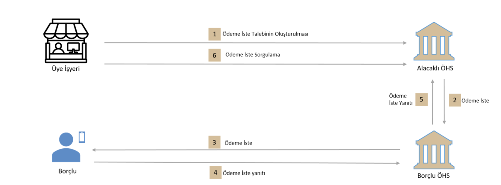

# 5. Ödeme İste Sistemi ve Kavramlar

## 5.1 Ödeme İste Akışı ve Temel Kavramlar

Ödeme iste, uçtan uca ödeme deneyiminin yalnızca bir parçası olarak görülmelidir. Örneğin, bir mal veya hizmet bedelinin ödenmesi işleminde, ödemenin çeşidi ve yönteminin karmaşıklığından bağımsız olarak, işlem aşağıdaki temel bileşenlere ayrılabilmektedir:

-	Ödemeye konu olan işlemin gerçekleştirilmesi (Öİ kuralları kapsamı dışındadır)
-	Alacaklının talebi ile ÖHS’si tarafından, borçlunun hesap bilgileri kullanılarak Ödeme İste talebinin Borçlu’ya sunulması
-	Borçlu’nun Ödeme İste’ye Yanıtı: Borçlu bu aşamada Öİ’yi kabul edebilir (kabul işlemi anlık veya ileri bir tarihte yapılmak üzere bir ödeme talimatı verilmesi anlamına gelir) veya reddedebilir.
-	Ödeme İşlemi: Ödeme kanalının seçilmesi ile başlayarak ödemenin ilgili altyapılara iletilmesi ile sonuçlanır.

## 5.2 Ödeme İste Tarafları

Ödeme İste Sistemi çerçevesinde dört tip aktör tanımlanmıştır:

-	**İşyeri**: Öİ Kurumsal API üzerinden Öİ talebi isteğinde bulunacak tüzel kişi 
-	**Alacaklı**: Öİ akışını başlatan ve Öİ akabinde gerçekleşen ödeme ve para transferi işleminde fonun transfer edildiği gerçek veya tüzel kişi
-	**Borçlu**: Öİ’nin sunulduğu, ödeme veya para transfer emrini veren gerçek veya tüzel kişi
-	**Alacaklı’nın Ödeme Hizmeti Sağlayıcısı (Katılımcı)**: Ödeme İste Sistemi Katılım Sözleşmesini imzalayarak Sisteme katılan, Sistemde doğrudan işlem yapmaya yetkili ve Alacaklı’ya ödeme iste ve ödeme hizmeti veren katılımcı
-	**Borçlu’nun Ödeme Hizmeti Sağlayıcısı (Katılımcı)**: Ödeme İste Sistemi Katılım Sözleşmesini imzalayarak Sisteme katılan, Sistemde doğrudan işlem yapmaya yetkili ve Borçlu’ya ödeme iste ve ödeme hizmeti veren katılımcı

## 5.3 İşyeri Alacaklı ÖHS Akışı

**1.**  İşyeri, ilgili hesap bilgilerini girerek ödeme iste talebini Alacaklı ÖHS’ye iletir.  
**2.**	Alacaklı ÖHS, işyerinden gelen ödeme isteğini API üzerinden alır.  Alacaklı ÖHS, gerekli kontrolleri yaptıktan sonra, Ödeme İste Sistemi üzerinden Öİ mesajını oluşturarak Borçlu ÖHS’ye gönderir. 
**3.**	Borçlu ÖHS, kendisine gelen ödeme iste talebini Borçlu’ya anlık bir bildirim ile iletir.  
**4.**	Borçlu, Öİ’ye verdiği yanıtı (Kabul/Ret) Borçlu ÖHS’ye iletir. 
**5.**  Borçlu ÖHS, alacaklı ÖHS'ye ödeme iste yanıtını gönderir. 
**6.**	İşyeri tarafından belirli periyotlar ile sorgulama yapılarak ödeme iste talebinin durumu öğrenilir. 

## 5.4 Ödeme İste Zaman Tanımları

Öİ akışında aşağıdaki zaman damgaları tanımlanmaktadır:
-	**Ödeme İste Oluşturulma Zamanı (ÖİOZ)**: Öİ’nin oluşturulduğu zamandır.
-	**Son Geçerlilik Zamanı (SGZ)**: Borçlu’nun Öİ talebine yanıt verebileceği son zaman bilgisidir. Bu zamandan sonra Öİ talebi geçersiz sayılacaktır. 
-	**Talep Edilen Ödeme Zamanı (TEÖZ)**: Alacaklı’nın, Öİ talimatı içerisinde yer alan ve ödemenin yapılmasını talep ettiği tarih/zaman bilgisidir.
