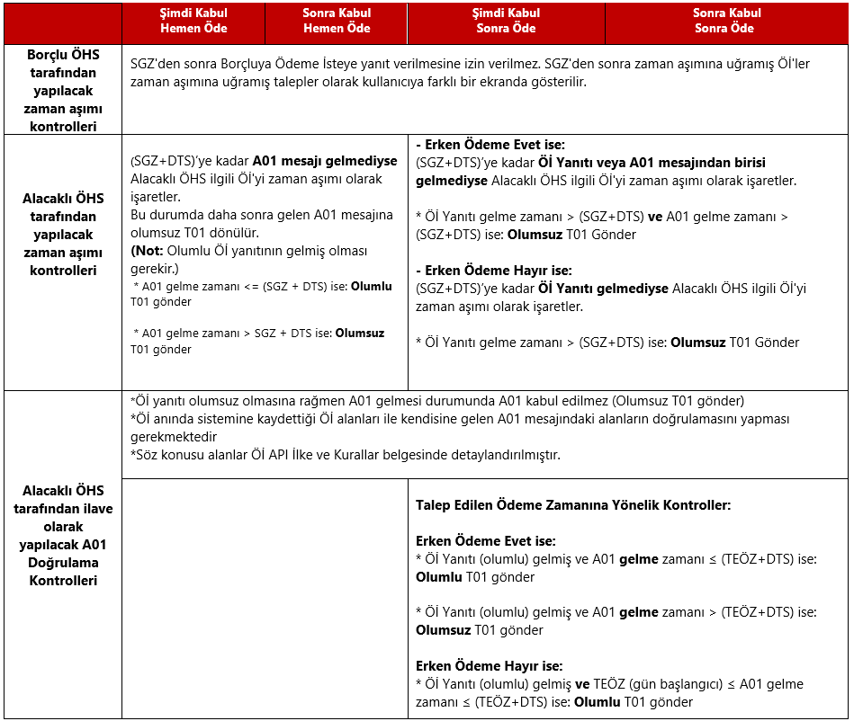

# 8.Ödeme İste Zaman Aşımı ve FAST Doğrulama Kontrolleri

Borçlu ve Alacaklı ÖHS’nin Öİ talepleri için zaman aşımı kontrollerini yapması, Alacaklı ÖHS’nin Öİ talebine yönelik olarak gelen A01 mesajını doğrularken Öİ kapsamında aşağıda yer alan doğrulamaları gerçekleştirmesi beklenmektedir. 

Borçlu ÖHS SGZ’ye kadar henüz yanıtlanmamış Öİ taleplerini; Alacaklı ÖHS ise 
-	Hemen Öde senaryoları için SGZ+DTS(*)’ye kadar A01 mesajı gelmemiş ilgili Öİ taleplerini,

-	Sonra Öde senaryoları için,
     Erken Ödeme ‘Evet’ ise SGZ + DTS’ye kadar Öİ yanıtı ya da A01 mesajı gelmemiş 
     Erken Ödeme ‘Hayır’ ise SGZ + DTS’ye kadar Öİ yanıtı gelmemiş Öİ taleplerini zaman aşımı olarak işaretler.

Borçlu ÖHS zaman aşımına uğramış Öİ’lere Borçlu’nun yanıt vermesine izin vermez ve söz konusu talepleri zaman aşımına uğramış talepler olarak farklı bir durum bilgisi ile Borçlu’ya gösterir.
Alacaklı ÖHS zaman aşımına uğramış Öİ talepleri için A01 alması durumunda olumsuz T01 gönderir.

Zaman aşımı kontrollerine ve FAST Referans Belgesinde yer alan A01 doğrulama kurallarına ek olarak Alacaklı ÖHS,
-	Ödeme İste anında sistemine kaydettiği Öİ alanları ile kendisine gelen A01 mesajındaki alanları doğrulaması
-	Aşağıdaki tabloda yer alan TEÖZ’e yönelik kontrolleri yapması
gerekmektedir.

*Doğrulama Tolerans Süresi (DTS): Alacaklı ÖHS tarafından yapılacak doğrulama kontrollerinde iletişim hattında geçen sürenin de gözetilmesi için kullanılacak ilave süredir. Bu süre sistem tarafından belirlenir ve 60 saniyedir.

**Tablo 10:FAST Doğrulama ve Kontrolleri Tablosu**

