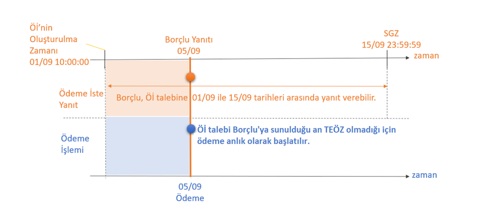

# 6. Ödeme İste Kullanım Modelleri

Katılımcıların, aşağıdaki modellerden dilediklerini Alacaklı’ya sunması mümkünken, Borçlu için tüm modelleri desteklemesi zorunludur.
-	Şimdi Kabul: (SGZ-ÖİOZ) = 180 saniye
-   Sonra Kabul: (SGZ-ÖİOZ) > 180 saniye
-	Hemen Öde: TEÖZ boş olarak iletildiğinde = Alacaklı Öİ‘yi oluşturduğu andan itibaren ödeme yapılmasını talep etmektedir. (Öİ’ye olumlu yanıt verildiği anda ödeme işlemi başlatılır.)
-	Sonra Öde: TEÖZ ≥ SGZ (Alacaklı, Öİ mesajının içerisine ödeme ile ilgili zaman bilgisi eklemiştir.) 
-	TEÖZ, SGZ alanı ile birlikte yorumlandığında; 
         Şimdi Kabul/Hemen Öde, 
         Şimdi Kabul/Sonra Öde,
         Sonra Kabul/Sonra Öde,
         Sonra Kabul/Hemen Öde 

şeklinde modeller kullanılabilir.

## 6.1 Sonra Kabul - Hemen Öde

Bu modelde, SGZ ile ÖİOZ arasındaki fark 180 saniyeden daha uzun bir süre olacak şekilde tanımlanarak “Sonra Kabul” işlemi olarak değerlendirilir. Ayrıca Alacaklı, Öİ’yi gönderdiği andan itibaren ödeme yapılmasını talep ettiği için Öİ’nin kabul edilmesi durumunda, kabul anında ödemenin başlatılmasını beklemektedir. TEÖZ boş olduğu bu işlem “Hemen Öde” olarak değerlendirilmelidir. 

Söz konusu senaryonun hesaplar arası (P2P) ödemelerde kullanılabileceği değerlendirilmektedir.

FAST ödemesi teknik bir sebeple gerçekleşmediği durumda Öİ işlemleri için ikinci defa FAST ödemesi gönderilmeyecektir.Tek bir Öİ talebi için en fazla 1 adet FAST işlemi gönderilebilir.

**Şekil 6: Sonra Kabul-Hemen Öde**

