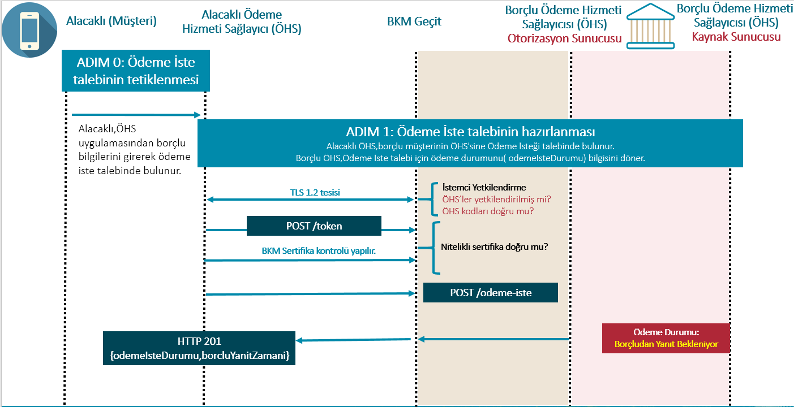
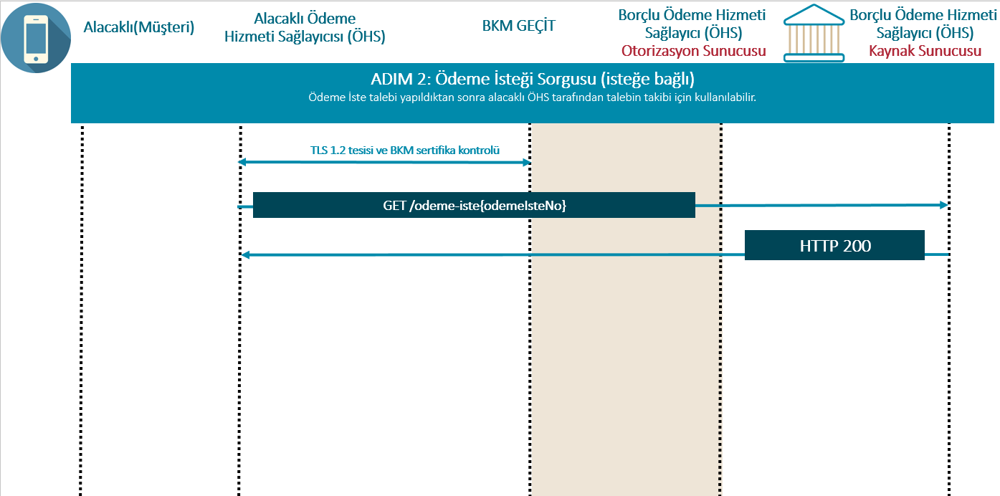
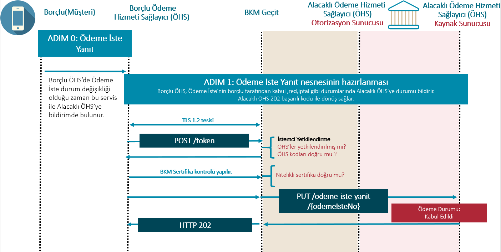
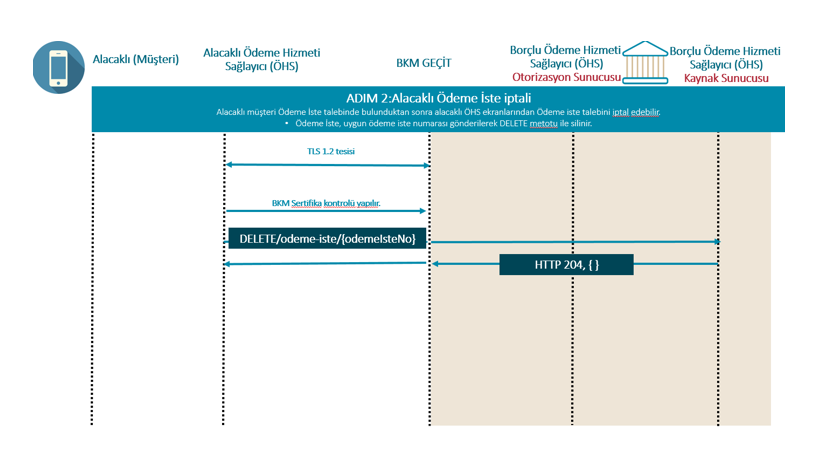

**Ödeme İste Hizmeti için Erişim Adresleri (Endpoints)**

**Tablo 7: Ödeme Emri Başlatma Hizmeti İçin Erişim Adresleri**

**Etki Alanı (Scope) ="odeme_iste"**

|No  |Kaynak |HTTP işlemi|Erişim Adresi |Zorunlu / İsteğe Bağlı|Yetkilendirme Türü |İmzalama |İstem Nesnesi |Yanıt Nesnesi |ÖHS Rolü |
| --- |--- |--- |--- |--- |--- |--- |--- |--- |--- |
| 1 | odeme-iste | POST | /odeme-iste | Z | İstemci Kimlik Bilgileri | İmzalı İstek ve Yanıt | OdemeIsteTalebi | OdemeIste | Borçlu 
| 2 | odeme-iste | GET |  /odeme-iste/{odemeIsteRefNo} | Z | İstemci Kimlik Bilgileri | İmzalı Yanıt |  | OdemeIste | Borçlu |
| 3 | odeme-iste | DELETE |  /odeme-iste/{odemeIsteRefNo} | Z | İstemci Kimlik Bilgileri |  |  |  | Borçlu |
| 4 | odeme-iste-yanit | PUT |  /odeme-iste-yanit/{odemeIsteRefNo}| Z | İstemci Kimlik Bilgileri | İmzalı İstek  | OdemeIsteYaniti |  | Alacaklı |
| 5 | sistem-olay-dinleme | POST |  /sistem-olay-dinleme	 | Z | İstemci Kimlik Bilgileri | - | Olay | - |Bu endpoint sadece BKM tarafından çağırılacaktır. |
## 7.1. ADIM 0: Alacaklı'nın Borçlu’ya Ödeme İste talebinde bulunması:

Borçlu, ÖHS uygulamasında (mobil Uygulama/ web arayüzü) Ödeme İste için Alacaklı’ya talepte bulunur.

## 7.2. ADIM 1: Ödeme İsteğinin Oluşturulması

Alacaklı ÖHS ile Alacaklı IBAN bilgileri uyumlu olmalıdır. Alacaklı IBAN bilgisinin Alacaklı ÖHS koduna ait olduğu kontrolü Borçlu tarafından yapılmalıdır.

**Şekil 7 : Ödeme İsteğinin Hazırlanması**

**BAŞARILI İSTEK ve YANIT :**

**Tablo 8: OdemeIsteTalebi ve Odeme Iste Nesnesi**

**Z: Zorunlu, K: Koşullu, İ: İsteğe Bağlı, N/A: Yok**

|Alan Adı |Json Alan Adı |Format: Veri Modeli İsmi |Açıklama|İstek |Yanıt |FAST A01 Mesaj Mapping |
| --- | --- | --- | --- | --- | --- | --- |
|Katılımcı Bilgisi | katilimciBilgi | Kompleks:KatilimciBilgisi | Katılımcılara atanmış kod bilgileridir.	 | Z | Z |  |
| > Alacaklı ÖHS Kod	|alacakliOhsKod	|AN4| Alacaklı ÖHS’ye ait kuruluş kodu	| Z | Z | |
| > Borçlu ÖHS Kod	|borcluOhsKod	|AN4| Borçlu ÖHS’ye ait kuruluş kodu	| Z | Z | |
|Alacaklı Bilgisi	|alacakliBilgi	|Kompleks:AlacakliBilgi| Alacaklıya ait bilgilerdir.	| Z | Z | |
| > Alacaklı Hesap/Müşteri Tipi	| musteriTipi	|AN1| Alacaklı müşterinin hesap numarasına ilişkin Ticari-Bireysel hesap bilgisi ayrımının belirtildiği alandır.  Ödeme İste Sistemi'nde tanımlı değerlerden biri olmalıdır. B:Bireysel  T: Ticari| Z | Z | |
| > Kimlik	|kimlik	|Kompleks:Kimlik| 	| Z | Z | |
|  >> Alacaklı Kimlik Tipi	|kimlikTipi	|AN1| TR.OIS.DataCode.KimlikTur sıralı veri türü değerlerinden birini alır.| Z | Z | |
|  >> Alacaklı Kimlik No ( TCKN/VKN/YKN/Pasaport No ) |kimlikDegeri|AN7..11| Alacaklı müşteriye ait geçerli bir TC Kimlik Numarası, Vergi Kimlik Numarası, Yabancı Kimlik Numarası ya da Pasaport Numarası bilgilerinden birinin bulunduğu alandır.| Z | Z | AlKmlkN |
| > Hesap	|hesap	|Kompleks:Hesap| 	| Z | Z | |
|  >> Alacaklı Ad Soyad/Ticari Unvan |hesapSahibi	|AN3..140| Alacaklı müşterinin ad-soyad veya ticari ünvan bilgisidir.  İşyeri için ilgili acquirer üye tarafından tahsis edilmiş olan işyeri adı bilgisidir.(Merchant Name) İşyerinin sık kullanılan adı ya da tabela ünvanı olmalıdır.  Alfanumerik karakterler, '.' , '-' , '&' ve boşluk karakteri içerebilir.Borçlu ÖHS’ye Alacaklı ÖHS tarafından Unvan bilgisi açık bir şekilde iletilmelidir. Borçluya ÖHS ekranlarında gösterimi açık olmalıdır.| Z | Z |AlAd|
|  >> Alacaklı IBAN	|hesapNo	|AN26| Alacaklı müşteriye ait bir IBAN olmalıdır. TR ile başlamalı ve 26 karakter uzunluğunda iletilmelidir.Borçlu ÖHS’ye Alacaklı ÖHS tarafından IBAN açık bir şekilde iletilmelidir. Borçluya ÖHS ekranlarında gösterimi açık olmalıdır.| Z | Z |AlHesN |
|Borçlu Bilgisi	|borcluBilgi	|Kompleks:BorcluBilgi| Borçluya ait bilgilerdir.	| Z | Z | ||Borçlu Bilgisi	|borcluBilgi	|Kompleks:BorcluBilgi| Borçluya ait bilgilerdir.	| Z | Z | |
| > Hesap	|hesap	|Komlepks:Hesap|	| Z | Z | |
| >> Borçlu Ad Soyad/Ticari Unvan	|hesapSahibi	|AN3..140| Borçlu müşterinin ad-soyad veya ticari ünvan bilgisidir.İşyeri için ilgili acquirer üye tarafından tahsis edilmiş olan işyeri adı bilgisidir.(Mercant Name)İşyerinin sık kullanılan adı ya da tabela ünvanı olmalıdır.Alfanumerik karakterler, '.' , '-' , '&' ve boşluk karakteri içerebilir.| Z | Z | |
| >> Borçlu IBAN |hesapNo	|AN26|Borçlu müşteriye ait bir IBAN olmalıdır. TR ile başlamalı ve 26 karakter uzunluğunda iletilmelidir. Borçlu IBAN gönderimi zorunludur. Borçlu IBAN bilgisi borçlu müşteri tarafından değiştirilebilir.Bu sebeple istekte iletilen IBAN bilgisi alacaklı ÖHS tarafından kontrol edilmemelidir.	| Z | Z | |
| > KOLAS Referans Numarası	|kolasRefNo	|N12| Kolay Adres bilgisi ile başlatılan Ödeme İste taleplerinde, Borçlu müşteriye ait Kolay Adres bilgisine ait hesap bilgisine erişebilmek amacıyla Alıcı müşterinin Ödeme Hizmet Sağlayıcısı tarafından KOLAS’a iletilen Alıcı Sorgu mesajına KOLAS tarafından dönülen referans numarasıdır. 	| K | K | |
| > TR Karekod Referans Numarası	|karekodRefNo	|AN1..12|TR Karekod ile başlatılan Ödeme İste taleplerinde TR Karekod için oluşturulan tekil referans numarasıdır. İşyeri uygulaması veya TR Karekod üreticisi tarafından sağlanır ve uçtan uca doğrulama, işlem kaydı veya fiş oluşturmada kullanılır. 	| K | K | |
|Tutar Bilgileri	|tutarBilgi	|Kompleks: TutarBilgi|	| Z | Z | |
|> Tutar	|tutar	|AN1..24| Alacaklı ÖHS’nin önyüzde kullanıcıdan aldığı tutar bilgisidir.	| Z | Z |Ttr |
|> Para Birimi	|paraBirimi	|AN3| Para birimi. FAST işlemleri kapsamında sadece TL gönderimi olacaktır. 	| Z | Z | |
|Ödeme İste Talep Detayı	|talepDetayi	|Kompleks:TalepDetay|	| Z | Z | |
|> Ödeme İste Referans Numarası	|odemeIsteRefNo	|AN41|Ödeme İste sistemi numarasıdır.Alacaklı ÖHS tarafından oluşturulmalıdır. Ödeme İste Referans Numarası'nın son 6 karakteri, alacaklı ile borçlu müşteriye işlem sırasında ilgili ekranlarda gösterilmelidir.Alacaklıya Ödeme İste talebi oluşturulacağı ekranda, borçluya ise ödeme iste detayının verildiği ekranda gösterilmelidir.  Önerilen Format:   {alacakliOhsKodu}-{guid}   Örn: 8000- f534e8f2-9fbf-48cc-914b-12fbaffd8104    (size: 41)| Z | Z | OiRef|
|> Ödeme İste Oluşturulma Zamanı	|odemeIsteOlusturulmaZamani	|ISODateTime|Kaydın ilk oluşturulduğu gün ve zaman bilgisini içerir. YYYY-MM-DDThh:mm:ss+03:00 formatında Ödeme İste Sistemi tarafından oluşturulur. | Z | Z | |
|> Ödeme İste Akış Türü	|akisTur	|AN2|01: Kişiden Kişiye 02: İşyeri Ödemesi| Z | Z |OiAksTur |
|> Ödeme Amacı	|odemeAmaci	|AN2|TR.OIS.DataCode.OdemeAmaci sıralı veri değerlerinden birini alır. Borçlu bu bilgiyi değiştiremeyecektir.Sadece alacaklı seçebilir.| Z | Z |OdmAmc |
|> Son Geçerlilik Zamanı (SGZ)	|sonGecerlilikZamani	|ISODateTime|Borçlu’nun Öİ talebine yanıt verebileceği son zaman bilgisidir. Bu zamandan sonra Öİ talebi geçersiz sayılacaktır. Son geçerlilik zamanı Öİ Oluşturulma Zamanından en fazla 3 ay sonrası olabilir.Alacaklı müşteri tarafından ödeme isteği oluşturulurken seçilir. Bugün : 31.11.2019 Bugün + 3 Ay : 29.02.2020 Bugün : 30.09.2022 Bugün + 3 Ay : 30.12.2022 Bugün : 14.07.2022 Bugün + 3 Ay : 14.10.2022 | Z | Z | |
|>Talep Edilen Ödeme Zamanı (TEÖZ)	|talepEdilenOdemeZamani	|ISODateTime| Alacaklı’nın, Öİ talimatı içerisinde yer alan ve ödemenin yapılmasını talep ettiği tarih/zaman bilgisidir.Hemen Öde seçeneğinde TEÖZ bilgisi boş iletilmelidir.Dolu iletilmesi durumunda borçlu ÖHS tarafından hata mesajı üretilmelidir. TEÖZ tarih formatı: YYYY-MM-DDThh:mm:ss| Z | Z | |
|> İşlem Açıklaması	|islemAciklamasi	|AN1..200|Alacaklı tarafından Borçlu'ya iletilecek Açıklama bilgisidir.Borçlu açıklamayı güncelleyebilmelidir.Borçlu Açıklama bilgisi FAST mesajına taşınacaktır.| İ | İ |Acklm |
|Ödeme İste Yanıt Detayı	|yanitDetayi	|Kompleks:YanıtDetayı|	| NA | Z | |
|> Ödeme İste Durumu	|odemeIsteDurumu	|AN1|TR.OIS.DataCode.OdemeIsteDurumu sıralı veri tipini değerlerinden birini alır. Örn; ödeme iste'ye ait ilk istek mesajına dönüşte “B: Yanıt Bekleniyor” değerini alması beklenir.| NA | Z | |
|> Ödeme İste İptal Detay Kodu	|odemeIsteIptalDetayKodu	|AN2|Rıza durumunun iptal olduğu durumda zorunludur.| NA | K | |
|> Borçlu Yanıt Zamanı	|borcluYanitZamani	|ISODateTime|Kabul ya da red durumunda gönderilebilecektir.| NA | K | |
|> Beklenen Ödeme Tarihi	|beklenenOdemeTarihi	|ISODate|Borçlu’nun ödemeyi taahhüt ettiği tarih bilgisidir. Sonra öde seçeneklerinde Borçlu’nun ödeme yapacağı tarih bilgisidir. Hemen öde seçeneklerinde ise Borçlu’nun kabul ettiği tarih bilgisidir.| NA | K | |
|> Ödeme Sistemi Gönderim Zamanı	|odemeSistemineGonderimZamani	|ISODateTime|Borçlu ÖHS tarafından ödemenin ödeme sistemine gönderilme zamanıdır.| NA | K | |

**Z: Zorunlu, K: Koşullu, İ: İsteğe Bağlı, N/A: Yok**

## 7.3. ADIM 2: Ödeme İsteğinin Sorgulanması

**Şekil 8 : "OdemeIste" nesnesinin sorgulanması(isteğe bağlı)**

**GET /odeme-iste/{ odemeIsteRefNo }**

Alacaklı, ödeme isteğinin mevcut durumunu kontrol etmek için, oluşturulan bir OdemeIste kaynağının durumunu isteğe bağlı olarak alabilir.

**Durum**

OdemeIste kaynağı için kullanılabilecek durum göstergeleri şu şekildedir:

-	Yanıt Bekleniyor
-	Kabul Edildi
-	Ödeme Sistemine Emir İletildi
-	İptal Edildi

## 7.4. ADIM 3: Ödeme İste Yanıtı

**BAŞARILI İSTEK:**

PUT işleminin REQUEST gövdesini (BODY) oluşturan "OdemeIsteYaniti" nesnesi Tablo-9’daki parametrelerden oluşur:

**Şekil 9: "OdemeIsteYaniti"**

**Tablo 9: OdemeIsteYaniti Nesnesi**

|Alan Adı |Json Alan Adı |Format: Veri Modeli İsmi |Açıklama|İstek |
| --- | --- | --- | --- | --- |
|Katılımcı Bilgisi | katilimciBilgi | Kompleks:KatilimciBilgisi | Katılımcılara atanmış kod bilgileridir.	 | Z |
| > Alacaklı ÖHS Kod	|alacakliOhsKod	|AN4| Alacaklı ÖHS’ye ait kuruluş kodu	| Z | 
| > Borçlu ÖHS Kod	|borcluOhsKod	|AN4| Borçlu ÖHS’ye ait kuruluş kodu	| Z |
|Borçlu Hesap | borcluHesap | Kompleks:Hesap| Borçluya ait güncellenebilen  bilgilerdir.	 | Z |
| > Borçlu Ad Soyad/Ticari Unvan	|hesapSahibi	|AN3..140| Borçlu müşterinin ad-soyad veya ticari ünvan bilgisidir.İşyeri için ilgili acquirer üye tarafından tahsis edilmiş olan işyeri adı bilgisidir.(Mercant Name)İşyerinin sık kullanılan adı ya da tabela ünvanı olmalıdır.Alfanumerik karakterler, '.' , '-' , '&' ve boşluk karakteri içerebilir.| Z |
| > Borçlu IBAN |hesapNo	|AN26|Borçlu müşteriye ait bir IBAN olmalıdır. TR ile başlamalı ve 26 karakter uzunluğunda iletilmelidir. Borçlu IBAN gönderimi zorunludur. Borçlu IBAN bilgisi borçlu müşteri tarafından değiştirilebilir.Bu sebeple istekte iletilen IBAN bilgisi alacaklı ÖHS tarafından kontrol edilmemelidir.	| Z | 
| Ödeme İste Referans Numarası	|odemeIsteRefNo	|AN41|Ödeme İste sistemi numarasıdır.Alacaklı ÖHS tarafından oluşturulmalıdır. Ödeme İste Referans Numarası'nın son 6 karakteri, alacaklı ile borçlu müşteriye işlem sırasında ilgili ekranlarda gösterilmelidir.Alacaklıya Ödeme İste talebi oluşturulacağı ekranda, borçluya ise ödeme iste detayının verildiği ekranda gösterilmelidir.  Önerilen Format:   {alacakliOhsKodu}-{guid}   Örn: 8000- f534e8f2-9fbf-48cc-914b-12fbaffd8104    (size: 41)| Z |
| Ödeme İste Durumu | odemeIsteDurumu | AN1 | "B": borçludan yanıt bekleniyor "K": borçlu kabul etti.  "O": ödeme sistemine emir iletildi.  "I": iptal.| Z |
| Ödeme İste İptal Detay Kodu | odemeIsteIptalDetayKodu | AN2 | "iptalDetay" : "01" borçlu ödeme isteğini red etti.B durumdayken B->I  "iptalDetay" : "02" borçlu beklenen sürede ödeme isteğine yanıt vermedi. B durumdayken B->I "iptalDetay" : "03" borçlu iptal etti. K durumdayken K->I "iptalDetay" : "04" beklenen sürede ödeme sistemine emir iletilmedi. K -> I "iptalDetay" : "05" borçlu ÖHS fraud nedeniyle iptal etti. B,K -> I "iptalDetay" : "11" alacaklı ödeme iste talebinden vazgeçti. B,K -> I  "iptalDetay" : "12" alacaklı ÖHS fraud nedeniyle iptal etti. B,K -> I| K |
| Borçlu Yanıt Zamanı | borcluYanitZamani | ISODateTime | Kabul ya da red durumunda gönderilebilecektir. | K |
| Beklenen Ödeme Tarihi | beklenenOdemeTarihi | ISODate | Borçlu’nun ödemeyi taahhüt ettiği tarih bilgisidir. Sonra öde seçeneklerinde Borçlu’nun ödeme yapacağı tarih bilgisidir. Hemen öde seçeneklerinde ise Borçlu’nun kabul ettiği tarih bilgisidir.  | K |
| Ödeme Sistemi Gönderim Zamanı | odemeSistemineGonderimZamani | ISODateTime | Borçlu ÖHS tarafından ödemenin ödeme sistemine gönderilme zamanıdır. | K |
|İşlem Açıklaması	|islemAciklamasi	|AN1..200|Alacaklı tarafından Borçlu'ya iletilecek Açıklama bilgisidir.Borçlu açıklamayı güncelleyebilmelidir.Borçlu Açıklama bilgisi FAST mesajına taşınacaktır.| İ |
**BAŞARILI YANIT:**

Başarılı PUT isteği sonucu HTTP 202 Accepted ile dönülmelidir.

## 7.5. ADIM 4: Ödeme İste İptal Senaryosu

**Şekil 10: "OdemeIste" İptalinin sağlanması**

Ödeme iste talebi oluşturulduktan sonra bekleyen talepler Alacaklı tarafından değiştirilemez.Alacaklı, bir Öİ talebini Borçlu’ya gönderdikten sonra ödeme yapılmamış ise iptalini talep edebilir. İptal talebi, Alacaklı ÖHS tarafından Borçlu’nun bilgilendirilmesi için Borçlu ÖHS’ye Ödeme İste Sistemi kullanılarak iletilir.

-	Yalnızca **ödemesi gerçekleşmemiş** Öİ iptal edilebilir. Öİ’ye yanıt verilmiş olup olmaması iptale engel değildir.
-	Sonra Öde senaryolarında, **TEÖZ’e kadar** ödemesi gerçekleşmemiş Öİ için iptal talebi gönderilebilir. 
-	Hemen Öde senaryolarında, **SGZ’ye kadar** ödemesi gerçekleşmemiş Öİ için iptal talebi gönderilebilir. 
-	Alacaklı ÖHS, iptal talebini Borçlu ÖHS’ye iletmeden önce ilişkili Öİ’nin durumunu kontrol etmelidir. Örneğin, Öİ’nin daha önce reddedilmediğini, SGZ’nin geçmediğini vb. 
-	Katılımcılar gerekli durumlarda teknik hata ya da dolandırıcılık şüphesi gibi nedenlerle Öİ iptal talebi gönderebilir. 
-	Alacaklı ÖHS, iptal talebini başarıyla ilettiği Öİ talebine karşılık oluşturulmuş bir ödeme işlemi varsa bu ödemeyi reddeder.
-	Borçlu ÖHS, gelen iptal talebine ilişkin Borçlu’yu bilgilendirmelidir.

## 7.6. Ödeme İste Sistem Olay Dinleme

POST /sistem-olay-dinleme

ÖHS'lerin sistem olaylarını dinleme amacıyla açması gereken endpoint bilgisidir.

OHS API içerisinde yapılan değişikliklerde, BKM tarafından ÖHS'lere olay bildirimleri yapılır.

Olaylar yanıt nesnesi içerisinde 1 adet kayıt yer alacaktır.

Başarılı POST isteği sonucu HTTP 202 Accepted kodu ile dönülmelidir.

ÖHS'den başarılı yanıt alınamadığı durumda, 5 dakika aralıklarla 3 kez deneme yapılacaktır. Hata alınmaya devam edilmesi durumunda başka bir aksiyon alınmayacaktır.

**Tablo 10: Olay Nesnesi**

|Alan Adı |Json Alan Adı |Format: Veri Modeli İsmi |Açıklama|İstek |
| --- | --- | --- | --- | --- |
| Olay Numarası | olayNo | AN1..64 | Z | Olaya ait atanmış tekil kimlik numarası
| Olay Zamanı | olayZamani | ISODateTime | Z | Olayın oluşma zamanı |
| Olay Tipi | olayTipi	 | AN1..36	 | Z | TR.OIS.DataCode.OlayTip sıralı veri tiplerinden birini alır. |
| Kaynak Tipi | kaynakTipi | AN1..36	 | Z | TR.OIS.DataCode.KaynakTip sıralı veri tiplerinden birini alır. |
| Kaynak Numarası | kaynakNo | AN1..128	 | Z | Güncellenen kaynağa ait OHS sistemindeki tekil tanımlayıcı.|