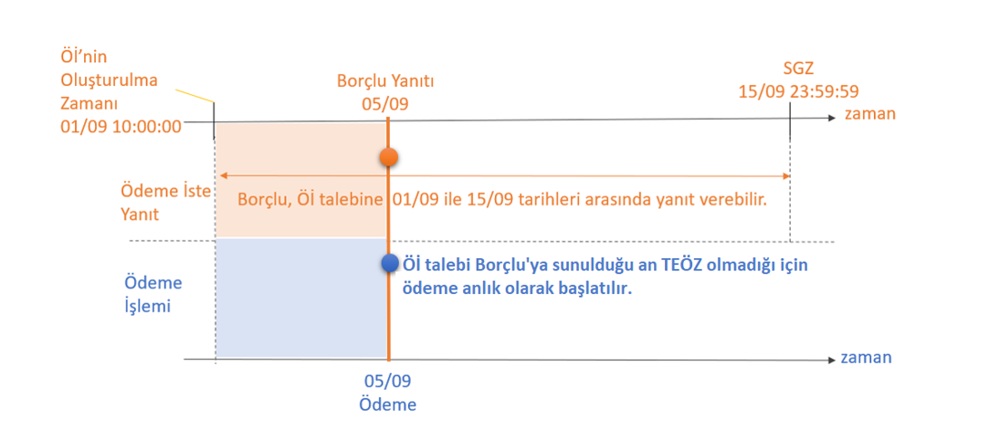
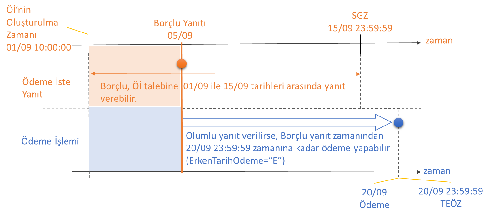
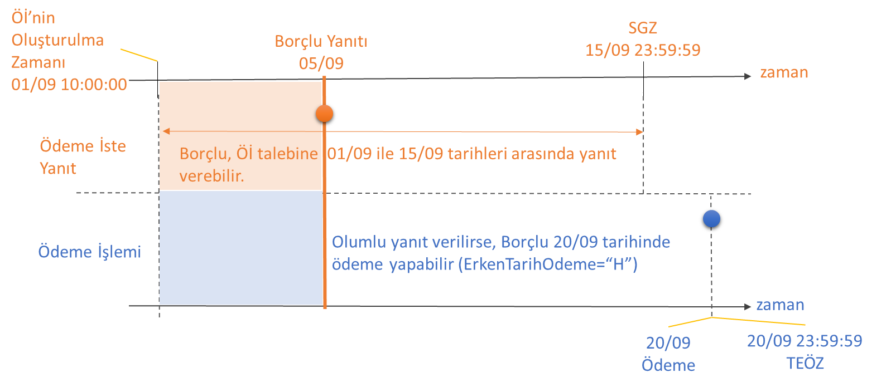

# 6. Ödeme İste Kullanım Modelleri ve Fonksiyonlar
## 6.1 Ödeme İste Kullanım Modelleri

Katılımcıların, aşağıdaki modellerden dilediklerini Alacaklı’ya sunması mümkünken, Borçlu için tüm modelleri desteklemesi zorunludur.
-	Şimdi Kabul: (SGZ-ÖİOZ) = 180 saniye
-   Sonra Kabul: (SGZ-ÖİOZ) > 180 saniye
-	Hemen Öde: TEÖZ boş olarak iletildiğinde = Alacaklı Öİ'yi oluşturduğu andan itibaren ödeme yapılmasını talep etmektedir. (ödeme iste talebine olumlu yanıt verildiği anda ödeme işlemi başlatılır.)
-	Sonra Öde: TEÖZ ≥ SGZ (Alacaklı, ödeme iste mesajının içerisine ödeme ile ilgili zaman bilgisi eklemiştir.) 
-	TEÖZ, SGZ alanı ile birlikte yorumlandığında; 
         Şimdi Kabul/Hemen Öde, 
         Şimdi Kabul/Sonra Öde,
         Sonra Kabul/Sonra Öde,
         Sonra Kabul/Hemen Öde 

şeklinde modeller kullanılabilir.

## 6.1.1 Sonra Kabul - Hemen Öde

Bu modelde, SGZ ile ÖİOZ arasındaki fark 180 saniyeden daha uzun bir süre olacak şekilde tanımlanarak “Sonra Kabul” işlemi olarak değerlendirilir. Ayrıca Alacaklı, ödeme iste talebini gönderdiği andan itibaren ödeme yapılmasını talep ettiği için ödeme iste talebinin kabul edilmesi durumunda, kabul anında ödemenin başlatılmasını beklemektedir. TEÖZ boş olduğu bu işlem “Hemen Öde” olarak değerlendirilmelidir. 

Söz konusu senaryonun hesaplar arası (P2P) ödemelerde kullanılabileceği değerlendirilmektedir.

FAST ödemesi teknik bir sebeple gerçekleşmediği durumda ödeme iste işlemleri için ikinci defa FAST ödemesi gönderilmeyecektir.Tek bir ödeme iste talebi için en fazla 1 adet FAST işlemi gönderilebilir.

**Şekil 6: Sonra Kabul-Hemen Öde**

## 6.1.2 Sonra Kabul - Sonra Öde

Bu modelde, SGZ ile ÖİOZ arasındaki fark 180 saniyeden daha uzun bir süre olacak şekilde tanımlanarak “Sonra Kabul” işlemi olarak değerlendirilir.  Sonra Kabul – Hemen Öde modelinden farklı olarak bu modelde TEÖZ alanının Öİ mesajının içerisinde yer almasıdır. TEÖZ ≥ SGZ olarak iletildiğinde “Sonra Öde” olarak değerlendirilir.
Sonra Kabul-Sonra Öde modeliyle birlikte ödeme iste sistemine yeni fonksiyonlar eklenmiştir. 6.2 Ödeme İste Fonksiyonlar başlığı altında detaylara yer verilmektedir.

Görselde anlatılan senaryoda, Alacaklı 01/09 10:00:00 zamanında gönderdiği ödeme iste talebine Borçlu’nun en geç 15 gün içerisinde yanıt vermesi beklemektedir. Alacaklı tarafından TEÖZ 20/09 23:59:59, ErkenTarihOdeme=”E” olarak belirlendiği için ödeme işlemi Borçlu’nun olumlu yanıt (kabul) anından itibaren TEÖZ (20/09)’e kadar borçlu tarafından seçilen bir tarihte yapılabilir. Söz konusu senaryonun genellikle kurumsal hesaplar arası (B2B) garantili ödemelerde kullanılabileceği değerlendirilmektedir.

**Şekil 7: Sonra Kabul-Sonra Öde**

Görselde anlatılan senaryoda, Alacaklı 01/09 10:00:00 zamanında gönderdiği ödeme iste talebine Borçlu’nun en geç 15 gün içerisinde yanıt vermesini beklemektedir. Alacaklı tarafından TEÖZ 20/09 23:59:59, ErkenTarihOdeme=”H” olarak belirlendiği için ödeme işlemi ancak TEÖZ (20/09) gününde yapılabilir. Söz konusu senaryonun çoğunlukla kurumsal hesaplar arası (B2B) garantili ödemelerde kullanılabileceği değerlendirilmektedir.

**Şekil 8: Sonra Kabul-Sonra Öde**

## 6.1.3 Şimdi Kabul - Hemen Öde

Bu modelde, SGZ ile ÖİOZ arasındaki fark 180 saniye olacak şekilde tanımlanarak “Şimdi Kabul” işlemi olarak değerlendirilir. Alacaklı, Borçlu’nun en geç 180 saniye içerisinde ödeme iste talebine yanıt vermesini beklemektedir. Alacaklı, ödeme iste talebini gönderdiği andan itibaren ödeme yapılmasını talep ettiği için ödeme iste talebinin kabul edilmesi durumunda, kabul anında (anlık) ödemenin başlatılmasını beklemektedir. 

SGZ ile ÖİOZ arasındaki zaman 180 saniye ve TEÖZ boş olarak iletildiğinde işlem “Şimdi Kabul - Hemen Öde” olarak değerlendirilmelidir. 

- Bu modelde (SGZ-ÖİOZ)-DTS < (SGZ-ÖİOZ) < (SGZ-ÖİOZ)+DTS şeklinde kontrol sağlanmalıdır.

Söz konusu senaryonun işyeri ödemelerinde kullanılabileceği değerlendirilmektedir. Borçlu ÖHS tarafından desteklenmesi zorunludur. 

## 6.2 Fonksiyonlar

Alacaklı ve Borçlu katılımcıların aşağıdaki fonksiyonların hepsini teknik olarak desteklemesi gerekmektedir. 

-	Kısmi Ödeme
-	Erken Ödeme
-	Ödeme Erteleme

## 6.2.1 Kısmi Ödeme

Kısmi Ödeme, bir borcun tamamını değil, belirli bir miktarının ödenmesidir.

Kısmi ödeme yapıldığında işlem sona erer. Kalan tutar alacaklı ile borçlu müşteri sorumluluğundadır. Alacaklı müşteri tarafından istenirse yeniden ödeme iste talebi yapılabilir. 

Borçlu ÖHS kısmi ödeme fonksiyonunu desteklemek zorundadır. Alacaklı ÖHS için bu fonksiyonun müşteriye sunulması isteğe bağlıdır.

Alacaklı ÖHS tarafından kısmi ödeme fonksiyonu müşteri ekranlarında müşteriye seçim olarak sunulabilir ya da müşteriye seçim yaptırılmadan ödeme iste talebinde varsayılan H olarak gönderilebilir.

Alacaklı ÖHS tarafından kısmi ödeme parametresi "E" olarak iletildiğinde borçlu müşteri tarafından tutar alanı güncellenebilir olmalıdır. Kısmi ödeme parametresi "H" olarak iletildiğinde tutar alanı borçlu müşteri tarafından güncellenemez olmalı ve ödeme iste talebi içerisinde yer alan tutarın tamamı ödenmelidir.

Tüm modellerde kullanılabilir. Kullanım detayları OdemeIsteTalebi ve Odeme Iste İstek Nesnesi içerisinde belirtilmektedir.

## 6.2.2 Erken Ödeme

Erken ödeme, bir borcun talep edilen ödeme zamanından (TEÖZ) önce ödenebilmesine imkan tanır. 

Sonra Öde modellerinde kullanılabilir. Hemen Öde modellerinde varsayılan 'E' olarak gönderilmelidir.

Borçlu ÖHS erken ödeme fonksiyonunu desteklemek zorundadır. Alacaklı ÖHS için bu fonksiyonun müşteriye sunulması isteğe bağlıdır.

Alacaklı ÖHS tarafından erken ödeme fonksiyonu müşteri ekranlarında müşteriye seçim olarak sunulabilir ya da müşteriye seçim yaptırılmadan ödeme iste talebinde varsayılan E olarak gönderilebilir.

Alacaklı ÖHS tarafından erken ödeme parametresi "E" olarak iletildiğinde borçlu müşterinin ekranlarından TEÖZ'e kadar bir tarih seçtirilmesine izin verilebilir. Ya da erken ödemeye izin verildiği için ödeme iste talebi kabul edildiği an ödeme gerçekleştirilebilir. Seçilen tarih beklenenOdemeTarihi olacaktır. Beklenen ödeme tarihinin TEÖZ ile aynı tarih olması durumunda; ödeme TEÖZ'den önce gerçekleştirilmelidir.

Alacaklı ÖHS tarafından erken ödeme parametresi "E" olarak iletildiğinde ödeme iste talebi ÖİOZ ile TEÖZ arasında seçilen bir tarihte gerçekleştirilebilir.

- ÖİOZ: 20.07.2024 17:30 ve TEÖZ: 20.08.2024 23:59 seçildiği durumda ödeme iste talebi 20.07.2024 17:30:00+03:00 ile 20.08.2024 23:59:59+03:00 arasında seçilen bir tarihte gerçekleştirilebilir. Örneğin; borçlu müşteri, 20.07.2024 tarihini seçerek kabul yanıtı verdiğinde ödeme iste talebi 20.07.2024 23:59:59+03:00 tarihine kadar gerçekleştirilmelidir.
- ÖİOZ: 20.07.2024 17:30 ve TEÖZ: 20.08.2024 14:30 seçildiği durumda ödeme iste talebi 20.07.2024 17:30:00+03:00 ile 20.08.2024 14:30:59+03:00 arasında seçilen bir tarihte gerçekleştirilebilir. Örneğin; borçlu müşteri, TEÖZ olan 20.08.2024 tarihini seçerek kabul yanıtı verdiğinde ödeme iste talebi 20.08.2024 14:30:59+03:00 tarihine kadar gerçekleştirilmelidir.

Alacaklı ÖHS tarafından erken ödeme parametresi "H" olarak iletildiğinde ödeme iste talebi TEÖZ'de gerçekleştirilmelidir.

- Beklenen Ödeme Tarihi: 20.07.2024 ve TEÖZ: 20.07.2024 23:59 seçildiği durumda ödeme iste talebi 20.07.2024 00:00:00+03:00 ile 20.07.2024 23:59:59+03:00 arasında gerçekleştirilmelidir.
- Beklenen Ödeme Tarihi: 20.07.2024 ve TEÖZ: 20.07.2024 17:30 seçildiği durumda ödeme iste talebi 20.07.2024 00:00:00+03:00 ile 20.07.2024 17:30:59+03:00 arasında gerçekleştirilmelidir.
- Beklenen Ödeme Tarihi: 20.07.2024 ve TEÖZ: 30.07.2024 23:59 seçildiği durumda ödeme iste talebi 20.07.2024 00:00:00+03:00 ile 20.07.2024 23:59:59+03:00 arasında gerçekleştirilmelidir.

## 6.2.3 Ödeme Erteleme

Ödeme Erteleme, bir borcun talep edilen ödeme zamanından (TEÖZ) sonra ödenebilmesine imkan tanır.

Sonra Öde modellerinde kullanılabilir. Hemen Öde modellerinde varsayılan 'H' olarak gönderilmelidir.

Borçlu ÖHS ödeme erteleme fonksiyonunu desteklemek zorundadır. Alacaklı ÖHS için bu fonksiyonun müşteriye sunulması isteğe bağlıdır.

Ödeme Erteleme fonksiyonu, Alacaklı ÖHS tarafından sadece kurumsal müşterilere sunulmalıdır. Bireysel müşterilere **sunulmamalıdır.**

Alacaklı ÖHS tarafından ödeme erteleme fonksiyonu müşteri ekranlarında müşteriye seçim olarak sunulabilir ya da müşteriye seçim yaptırılmadan ödeme iste talebinde varsayılan H olarak gönderilebilir. 

Alacaklı ÖHS tarafından ödeme erteleme parametresi "E" olarak iletildiğinde vadeTarihi ve vadeTutarı alanları da iletileceğinden bu değerler alacaklı müşteri tarafından girilebilir olmalıdır. 

Alacaklı ÖHS tarafından ödeme iste talebi vade tarihi, TEÖZ’den maksimum 3 ay sonrasına kadar ertelenebilir olmalıdır.

Borçlu müşteri ekranlarında ödeme iste talebi kabul edilirken vade seçimi yapılarak ödeme iste talebi kabul edilebilir. Ya da borçlu müşteri tarafından, erken ödeme parametresine bağlı olarak, TEÖZ'e kadar bir tarih seçilerek ödeme iste talebi kabul edilebilir. 

Kısmi ödeme ve ödeme erteleme birlikte kullanılarak ödeme iste talebi başlatılabilir. Ancak borçlu müşteri vade tarihi ve vade tutarı seçimi yaparak ödeme iste talebini kabul ettiğinde kısmi ödeme yapılmasına izin verilmemelidir. 