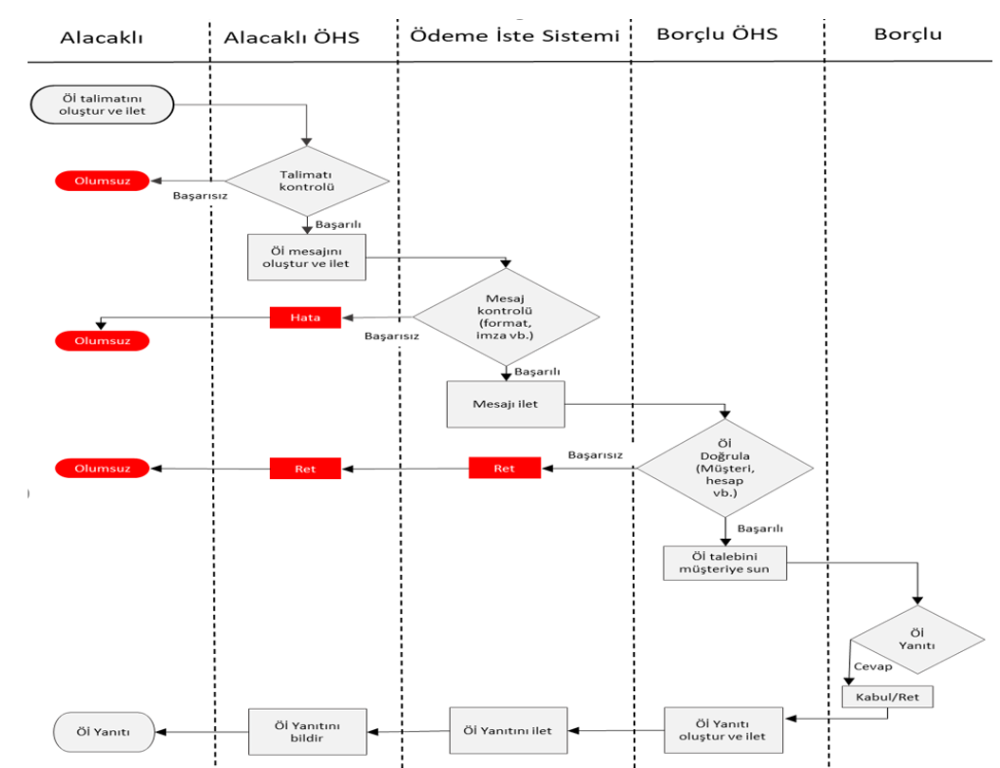
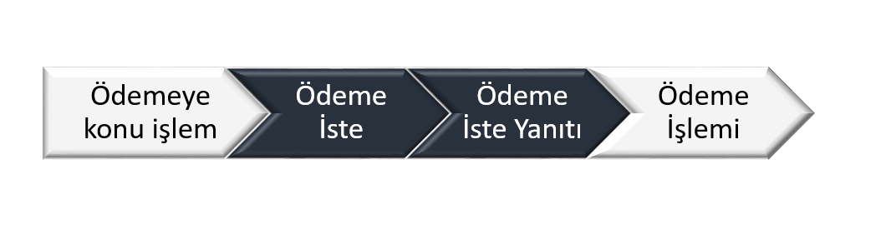
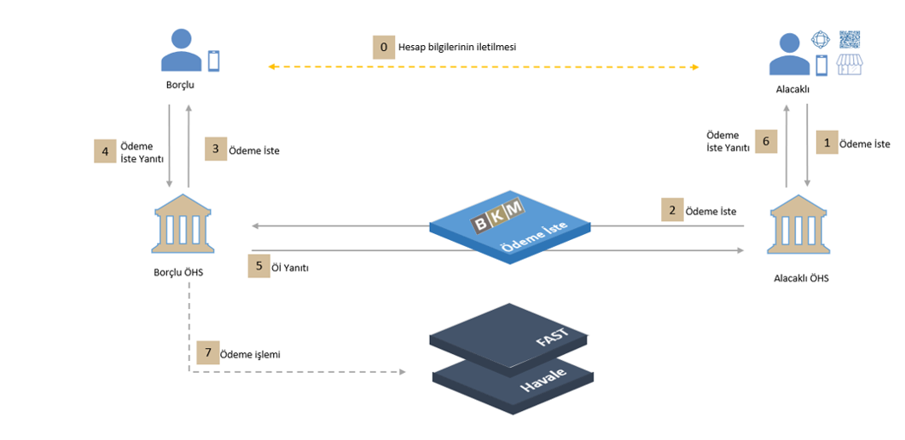
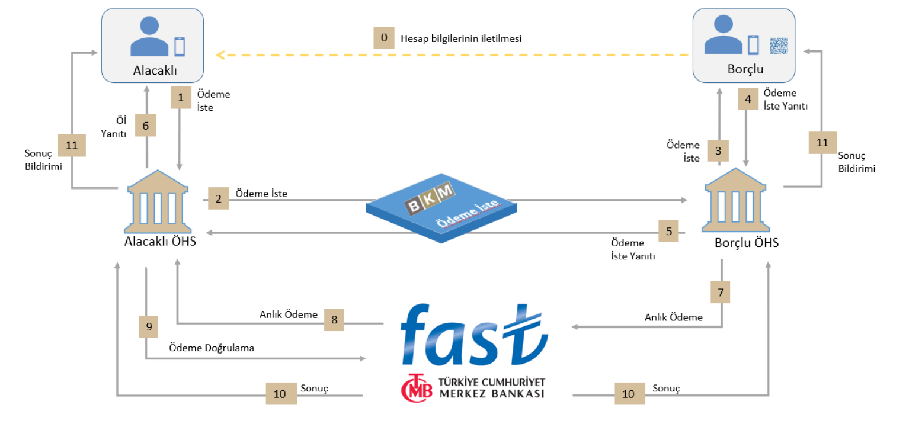
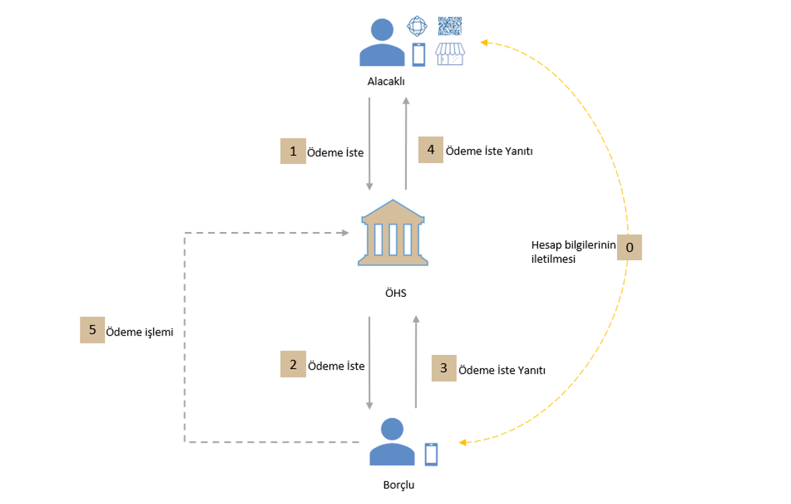

# 5. Ödeme İste Sistemi ve Kavramlar

**Şekil 1: Ödeme İste Genel Akış Diyagramı**

## 5.1 Ödeme İste Akışı ve Temel Kavramlar

Öİ, uçtan uca ödeme deneyiminin yalnızca bir parçası olarak görülmelidir. Örneğin, bir mal veya hizmet bedelinin ödenmesi işleminde, ödemenin çeşidi ve yönteminin karmaşıklığından bağımsız olarak, işlem aşağıdaki temel bileşenlere ayrılabilmektedir:

**Şekil 2: Ödeme İste Temel Bileşenleri**

-	Ödemeye konu olan işlemin gerçekleştirilmesi (Öİ kuralları kapsamı dışındadır)
-	Alacaklının talebi ile ÖHS’si tarafından, borçlunun hesap bilgileri kullanılarak Ödeme İste talebinin Borçlu’ya sunulması
-	Borçlu’nun Ödeme İste’ye Yanıtı: Borçlu bu aşamada Öİ’yi kabul edebilir (kabul işlemi anlık veya ileri bir tarihte yapılmak üzere bir ödeme talimatı verilmesi anlamına gelir) veya reddedebilir.
-	Ödeme İşlemi: Ödeme kanalının seçilmesi ile başlayarak ödemenin ilgili altyapılara iletilmesi ile sonuçlanır.

## 5.2 Ödeme İste Tarafları

Ödeme İste Sistemi çerçevesinde dört tip aktör tanımlanmıştır:
-	**Alacaklı**: Öİ akışını başlatan ve Öİ akabinde gerçekleşen ödeme ve para transferi işleminde fonun transfer edildiği gerçek veya tüzel kişi
-	**Borçlu**: Öİ’nin sunulduğu, ödeme veya para transfer emrini veren gerçek veya tüzel kişi
-	**Alacaklı’nın Ödeme Hizmeti Sağlayıcısı (Katılımcı)**: Ödeme İste Sistemi Katılım Sözleşmesini imzalayarak Sisteme katılan, Sistemde doğrudan işlem yapmaya yetkili ve Alacaklı’ya ödeme iste ve ödeme hizmeti veren katılımcı
-	**Borçlu’nun Ödeme Hizmeti Sağlayıcısı (Katılımcı)**: Ödeme İste Sistemi Katılım Sözleşmesini imzalayarak Sisteme katılan, Sistemde doğrudan işlem yapmaya yetkili ve Borçlu’ya ödeme iste ve ödeme hizmeti veren katılımcı

## 5.3 Dört Taraflı Model

Aşağıda, dört taraflı Öİ akışı ile gerçekleştirilen ve fiziki/sanal işyeri ödemeleri, fatura ödemeleri, kişiden kişiye ödemeler gibi temel kullanım senaryolarında kullanılabilecek genel bir iş akışı gösterilmektedir. Söz konusu modelde Borçlu ve Alacaklı farklı ÖHS’ler ile çalışmaktadır. Alacaklı, Öİ’yi Alacaklı ÖHS aracılığıyla Ödeme İste Sistemi üzerinden Borçlu’ya iletir. Öİ’nin iletilebilmesi için, Borçlu’nun ödeme hesap bilgilerinin (Kolay Adres, TR Karekod ya da IBAN+Ad Soyad) Alacaklı tarafından bilinmesi gerekmektedir.

Ödeme İste Sistemi dört taraflı modeli desteklemek üzere tasarlanmış olup, Alacaklı ve Borçlu’nun aynı ÖHS ile çalıştığı durumlarda Öİ ve akabindeki ödeme akışı ile ilgili işlemler, BKM tarafından işletilecek olan Ödeme İste Sistemi kullanılmadan ÖHS’nin iç sistemleri (havale) üzerinden ya da ÖHS isteğine bağlı olarak BKM tarafından işletilecek olan Ödeme İste Sistemi kullanılarak gerçekleştirilebilir.

Aşağıdaki genel iş akışında gösterimlerin basit olabilmesi amacıyla ödeme ve diğer yardımcı (Kolay Adresleme vb) akışlar gösterilmemiştir.

**Şekil 3: Ödeme İste Genel Akış**

(0)	Borçlu hesap bilgilerini (ad soyad, IBAN) doğrudan veya TR Karekod ile veya Kolay Adres bilgisi olarak Alacaklı ile paylaşır.(Kolay Adres paylaşılmış ise Alacaklı ÖHS’nin ilgili hesap bilgilerini alabilmek için KOLAS üzerinden sorgulama yapması gereklidir)
  (1) Alacaklı, ilgili hesap bilgilerini girerek Öİ talimatını Alacaklı ÖHS’ye iletir.
  (2) Alacaklı ÖHS, gerekli kontrolleri yaptıktan sonra, Ödeme İste Sistemi üzerinden Öİ mesajını oluşturarak Borçlu ÖHS’ye gönderir.
  (3) Borçlu ÖHS, kendisine gelen talimatı Borçlu’ya anlık bir bildirim ile iletir.
  (4) Borçlu, Öİ’ye verdiği yanıtı (Kabul/Ret) Borçlu ÖHS’ye iletir.
  (5) Borçlu ÖHS, Ödeme İste Sistemine Öİ Yanıt mesajını gönderir. 
  (6) Alacaklı ÖHS, Öİ Yanıtı’na ilişkin Alacaklı’ya anlık bildirim yapar.
  (7) Borçlu tarafından Öİ kabul edilmiş ise seçilen ödeme tarihinde ilgili ödeme sisteminden ödeme başlatılır.

**Şekil 4: Ödeme İste ile Kişiden Kişiye Ödemeler FAST Akışı**

Bu kullanım modelinde Borçlu’nun hesap bilgileri IBAN, Ad Soyad olarak girilebileceği gibi, Kolay Adres ile veya Kişiden Kişiye Ödemelerde sunulan karekod ile de sağlanabilir.

Aşağıdaki iş akışı çerçevesinde işlemler yürütülür: 

(0) Borçlu, hesap bilgilerini (IBAN/Ad Soyad veya Kolay Adres veya Kişiden Kişiye Ödeme karekodu aracılığıyla) Alacaklı ile paylaşır.

(1) Alacaklı, Alacaklı ÖHS’nin kanallarını kullanarak Öİ talebini oluşturur. (Kolay Adres bilgisi iletilmişse Alacaklı ÖHS’nin KOLAS üzerinden ilgili hesap bilgilerini sorgulaması gerekir.) 

(2) Alacaklı ÖHS, Öİ’yi oluşturarak Ödeme İste Sistemi üzerinden Borçlu ÖHS’ye iletir. Alacaklı ÖHS tarafından Öİ’ye ait bilgilerin katılımcı sistemine kaydedilmesi gerekir. 

(3) Borçlu ÖHS, gelen Öİ talebini gerekli doğrulama ve kontrolleri yaptıktan sonra Borçlu’ya iletir.

(4) Borçlu, SGZ’ye kadar Öİ talebine yanıt verir. (Olumlu yanıt verdiği varsayılmaktadır) 

(5) Borçlu ÖHS, gerekli kontrolleri yapar ve Öİ yanıtını oluşturarak Ödeme İste Sistemine gönderir.

(6) Alacaklı ÖHS, Alacaklı’ya Öİ Yanıtına ilişkin anlık bildirim yapar. 

(7) Borçlu ÖHS, anlık ödeme (A01) mesajını oluşturarak FAST Sistemine gönderir. (Hemen öde senaryolarında Ödeme işlemi Öİ yanıtıyla eş zamanlı olarak başlatılır.) 

(8) FAST, mesaj üzerinde kontrollerini gerçekleştirerek işlemi fon ayrımını gerçekleştirmek üzere sıraya yerleştirir ve mesajı Alacaklı ÖHS’ye yönlendirir. 

(9) Alacaklı ÖHS, gelen mesaj doğrultusunda zaman aşımı kontrollerine ek olarak ödemenin Alacaklı hesabına aktarılmasına yönelik Ödeme İste doğrulamasını aşağıdaki alanlara göre yaparak FAST’a teyit (T01) mesajı gönderir: 
  a. Öİ referans numarası, 
  b. Alacaklı kimlik numarası, 
  c. Alacaklı hesap adı/ünvanı, 
  d. Alacaklı hesap numarası, 
  e. Kabul edilen tutar, 
  f. Ödeme Amacı, 
  g. SGZ ve TEÖZ, 
  h. Öİ Akış Türü = “01” 
	
(10) T01 mesajını alan FAST, gerekli kontrolleri yaparak, mutabakat sürecini başlatır ve Alacaklı ÖHS ile Borçlu ÖHS’ye T02 sonuç bildirim mesajlarını iletir. 

(11) Alacaklı ÖHS, Alacaklı’yı ve Borçlu ÖHS ise Borçlu’yu işlemin sonucuna dair anlık olarak bilgilendirir. 

**Şekil 5: Ödeme İste ile Ödeme Akışı (Havale)**

Alacaklı ve Borçlu’nun aynı ÖHS ile çalıştığı durumlarda Öİ ve akabindeki ödeme akışı ile ilgili işlemler BKM tarafından işletilecek olan Ödeme İste Sistemi kullanılmadan ÖHS’nin iç sistemleri üzerinden gerçekleştirilebilir.

(0)	Borçlu hesap bilgilerini (ad soyad, IBAN) doğrudan veya TR Karekod ile veya Kolay Adres bilgisi olarak Alacaklı ile paylaşır. (Kolay Adres paylaşılmış ise Alacaklı ÖHS’nin ilgili hesap bilgilerini alabilmek için KOLAS üzerinden sorgulama yapması gereklidir)
  (1) Alacaklı, ilgili hesap bilgilerini girerek Öİ talimatını ÖHS’sine iletir.
  (2) ÖHS, gerekli kontrolleri yaptıktan sonra kendi iç sistemleri üzerinden Öİ’yi oluşturarak Borçlu’ya anlık bidirim ile iletir.
  (3) Borçlu, Öİ’ye yanıt (Kabul/Ret) verir.
  (4) ÖHS, Öİ Yanıtı’na ilişkin Alacaklı’ya anlık bildirim yapar. 
  (5) Borçlu tarafından Öİ kabul edilmiş ise seçilen ödeme tarihinde havale yoluyla ödeme gerçekleştirilir.

## 5.4 Ödeme İste Zaman Tanımları

Öİ akışında aşağıdaki zaman damgaları tanımlanmaktadır:
-	**Ödeme İste Oluşturulma Zamanı (ÖİOZ)**: Öİ’nin oluşturulduğu zamandır.
-	**Son Geçerlilik Zamanı (SGZ)**: Borçlu’nun Öİ talebine yanıt verebileceği son zaman bilgisidir. Bu zamandan sonra Öİ talebi geçersiz sayılacaktır. 
-	**Talep Edilen Ödeme Zamanı (TEÖZ)**: Alacaklı’nın, Öİ talimatı içerisinde yer alan ve ödemenin yapılmasını talep ettiği tarih/zaman bilgisidir. 
-	**Doğrulama Tolerans Süresi (DTS)**: Alacaklı ÖHS tarafından yapılacak doğrulama kontrollerinde iletişim hattında geçen sürenin de gözetilmesi için kullanılacak ilave süredir. Bu süre sistem tarafından belirlenir ve 60 saniyedir.

