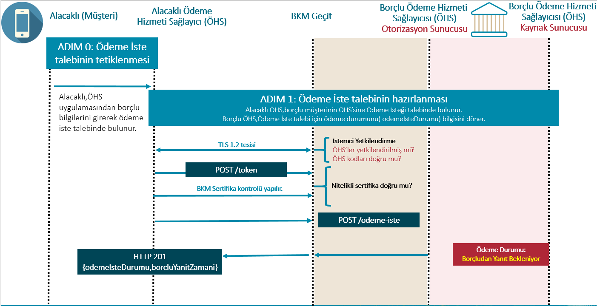
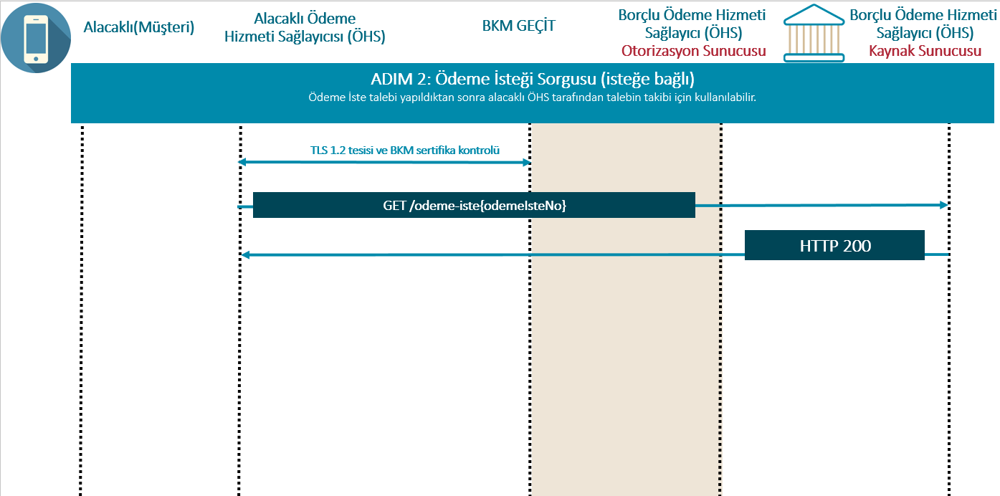
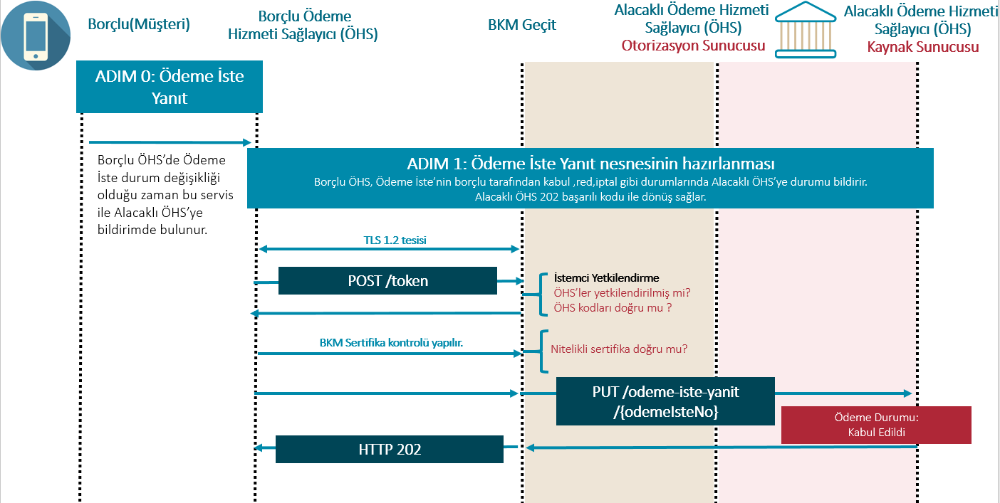

# 7.	Ödeme İste

## Genel Bilgiler

Alacaklı ÖHS; alacaklı müşterinin “Ödeme İste” talebi için OdemeIsteTalebi nesnesi ile Borçlu ÖHS’nin sunacağı ödeme iste erişim adresine bir POST isteğinde bulunur ve Borçlu tarafta bir OdemeIste nesnesi oluşturulur. Borçlu ÖHS ödeme istenin durumunu belirten bir statü döner(odemeIsteDurumu).Ödeme İste talebi borçlu müşterinin kabulü sonrası havale ya da FAST işlemiyle sonuçlanabilir. 

Ödeme İste Talebi 6 temel akışdan oluşur:

**1.** Alacaklı Müşterinin Borçlu Müşteriden Ödeme İste için talepte bulunması: Alacaklı müşteri ÖHS mobil uygulama ya da web uygulamasından zorunlu alanların seçimini ve girişini yaparak ödeme iste talebi başlatır.

**2.**	Ödeme İste Talebinin Hazırlanması: Alacaklı ÖHS, “Ödeme İste” talebi için zorunlu alanları doldurarak Borçlu ÖHS’ye iletir.

**3.**	Ödeme İste Talebinin Yanıtlanması: Borçlu ÖHS, müşterisine Ödeme İste Talebini bildirim aracılığı ya da kendi belirleyeceği metotlar ile yönlendirir. Müşteriyi doğruladıktan sonra ödeme iste talebine ait detaylı bilgileri gösterip  Kabul ya da Red seçeneklerinin Son Geçerlilik Zamanına kadar yanıt dönebilmesine olanak sağlar. 

**4.**	Ödeme İste Kabul ya da Red Yanıtının İletilmesi: Borçlu ÖHS,müşteriden alınan yanıtı OdemeIsteYanit Nesnesi ile Alacaklı ÖHS’ye bildirir.

**5.**	Ödeme İste Talebinin Ödeme Sistemine İletilmesi: 4.adımda Kabul statüsü iletildiği durumda;Borçlu ÖHS, Borçlu müşteriden olumlu yanıt aldığı durumda Alacaklı ÖHS’ye Ödeme İste talebinin kabul edildiğine dair bildirim yapar. Aynı zamanda ödeme işlemini FAST ya da Havale ile gerçekleştirmek üzere ilgili sistemlere aktarır.

**6.**	Ödeme İste Başarılı Yanıtın Güncellenmesi, İptal Yanıtının İletilmesi: FAST ya da Havale sistemlerine aktarılan Ödeme İste talebi başarılı olması durumunda ödeme gerçekleşir ve ödeme iste durumu hem Borçlu hem Alacaklı ÖHS tarafında güncellenir. Borçlu ÖHS tarafından OdemeIsteYanit nesnesi ile alacaklı ÖHS'ye Ödeme Gerçekleşti "O" durumu bildirilmez. İşlemin başarısız olması durumunda da iptal statüsü ile güncellenerek Borçlu ÖHS tarafından Alacaklı ÖHS'ye bildirilir.

**NOT: Katılımcının kendi sunucu saatiyle yaptığı kontrollerde Borçlu ve Alacaklı ÖHS'lerin sunucu saat farklılığını önlemek için tolerans süresi olarak +/- 1 dakika gözetilmelidir.**

## Ödeme İste Hizmeti için Erişim Adresleri (Endpoints)

**Tablo 7: Ödeme İste Hizmeti İçin Erişim Adresleri**

**Etki Alanı (Scope) ="odeme_iste"**

|No  |Kaynak |HTTP işlemi|Erişim Adresi |Zorunlu / İsteğe Bağlı|Yetkilendirme Türü |İmzalama |İstem Nesnesi |Yanıt Nesnesi |ÖHS Rolü |
| --- |--- |--- |--- |--- |--- |--- |--- |--- |--- |
| 1 | odeme-iste | POST | /odeme-iste | Z | İstemci Kimlik Bilgileri | İmzalı İstek ve Yanıt | OdemeIsteTalebi | OdemeIste | Borçlu 
| 2 | odeme-iste | GET |  /odeme-iste/{odemeIsteRefNo} | Z | İstemci Kimlik Bilgileri | İmzalı Yanıt |  | OdemeIste | Borçlu |
| 3 | odeme-iste | PUT |  /odeme-iste/{odemeIsteRefNo}/iptal     | Z | İstemci Kimlik Bilgileri | İmzalı İstek ve Yanıt | OdemeIsteIptal | OdemeIste | Borçlu |
| 4 | odeme-iste | PUT |  /odeme-iste/{odemeIsteRefNo}/yanit     | Z | İstemci Kimlik Bilgileri | İmzalı İstek ve Yanıt  | OdemeIsteYanit |OdemeIste  | Alacaklı |
| 5 | sistem-olay-dinleme | POST |  /sistem-olay-dinleme	 | Z | İstemci Kimlik Bilgileri | - | Olay | - |Bu endpoint sadece BKM tarafından çağırılacaktır. |

**Not: Başarılı isteklerde imza kontrolü zorunlu, hatalı isteklerde ise imza başlığı varsa kontrolü zorunludur.**

## 7.1. ADIM 0: Alacaklı'nın Borçlu’ya Ödeme İste talebinde bulunması:

Alacaklı ÖHS, alacaklı müşteri için Ödeme İste özelinde işlem bazlı limit tanımını aşağıdaki şekilde yapmalıdır.

Bireysel segment: Alacaklı müşteri için kimlik değeri(TCKN,YKN vb.) bazında (IBAN bazında değil) minimum 10, maximum 100 adet olabilecek şekilde limit belirlenmesi tavsiye edilmektedir. 

Kurumsal segment: Alacaklı müşteri için kimlik değeri(VKN,TCKN vb.) bazında (IBAN bazında değil) minimum 100, maximum 1000 adet olabilecek şekilde limit belirlenmesi tavsiye edilmektedir.

Limit belirlenmesinde ; alacaklı müşterinin yapmış olduğu ödeme iste taleplerinden ödeme iste durumu “B” statüsünde olan talepler limite dahil edilecektir. Örneğin ; alacaklı bireysel müşterinin limiti 10 adettir. Mevcutta yapmış olduğu 2 adet ödeme iste talebi bulunmaktadır. Bu taleplerden birisi “B” statüsünde diğeri “K”,”O” ya da “I” statülerinden birindeyse katılımcının kalan limiti 9 adet(B harici işlem) olmalıdır.

ÖHS’ler kendi inisiyatifinde belirleyecekleri limitler ile “I” statüsündeki Öİ taleplerini de kısıtlayabilirler. Ancak, “I” statüsünde özelinde belirlenen limitlerin belirli zaman aralığında(günlük, haftalık, aylık vb.) sıfırlanması gerekecektir. Örneğin ; Alacaklı bireysel müşterinin “I” statüsündeki limiti 50 adettir. “I” statüsü sıfırlanma tarih aralığı bir hafta ise son bir haftalık “I” adetleri bu limite dahil edilmelidir.

Mimimum ve maksimum’da belirtilen değerler arasında bir limit belirlenmesi Alacaklı ÖHS insiyatifindedir. Belirleyeceğiniz limitin parametrik olması tavsiye edilmektedir. Sonraki fazlarda aralık değiştirilebilir veya tamamen kaldırılabilir.

Alacaklı müşteri tarafından başlatılan Ödeme İste talebi için Borçlu ÖHS’de Borçlu Müşteri tarafından Alacaklı Müşteri’nin engellenmesi sağlanabilir. Bu özelliğin Borçlu Müşteri’ye sunulması Borçlu ÖHS inisiyatifindedir. Engellenen kullanıcı için Alacaklı ÖHS tarafından yapılacak sonraki isteklerde Borçlu ÖHS tarafından hata mesajı verilecektir. Verilecek olan hata kodu  **TR.OIS.Business.BlockedRecipient** olmalıdır.

Alacaklı Müşteri, limit ve yetki kontrollerinib başarılı olduğu durumda ÖHS uygulamasında (mobil uygulama/ web arayüzü) Ödeme İste için talepte bulunur. 

## 7.2. ADIM 1: Ödeme İsteğinin Oluşturulması

Alacaklı ÖHS ile Alacaklı IBAN bilgileri uyumlu olmalıdır. Alacaklı IBAN bilgisinin Alacaklı ÖHS koduna ait olduğu kontrolü Borçlu tarafından yapılmalıdır.

**Şekil 7 : Ödeme İsteğinin Hazırlanması**

-	Alacaklı ÖHS, uygulamadan borçlu bilgilerini (Borçlu tarafından hesap bilgisi (Ad Soyad, IBAN) olarak paylaşılabileceği gibi TR     Karekod veya Kolay Adres şeklinde de paylaşılabilir) girerek ödeme iste (odemeIste) talebinde bulunur.
- Alacaklı ÖHS tarafında Kolay Adres ile sorgulanan borçlu müşteriye ait Unvan ve IBAN bilgileri maskeli olarak gösterilmelidir. TR Karekod üzerinden yapılan sorgulama sonucu gelen borçlu müşteriye ait Unvan ve IBAN bilgileri açık olacak şekilde gösterilmelidir.
-	POST isteği TLS protokolü tesis edilen iletişim katmanı üzerinden gerçekleştirilir. TLS için nitelikli sertifikalar kullanılır.
-	POST isteğinin başlığındaki alanlar ve istemcinin sertifikasındaki özel alanlar kullanılarak BKM Geçit tarafından istemcinin yetkilendirilmesi sağlanır.
    -   İstekte bulunan ÖHS yetkilendirilmiş mi?
    -   İstekte bulunulan ÖHS kodu doğru mu?
- ÖHS'ler tarafından istek gövdesi içerisinden yer alan alacakliOhsKod ve borcluOhsKod bilgilerinin istek başlığı içerisinde yer alan x-source-code ve x-target-code alanları ile uyumluluğu kontrol edilecektir. 
    -   İstek gövdesinde yer alan alacakliOhsKod değerinin istek başlığında yer alan x-source-code değerinden farklı olması durumunda **TR.OIS.Resource.RecipientMismatch** hatası verilmelidir.  
    -   İstek gövdesinde yer alan borcluOhsKod değerinin istek başlığında yer alan x-target-code değerinden farklı olması durumunda **TR.OIS.Resource.SenderMismatch** hatası verilmelidir. 
-	POST başarılı olursa, Borçlu ÖHS, Ödeme İste talebi için ödeme durumunu içeren odemeIsteDurumu yanıt olarak döner.
-	Alacaklı ÖHS tarafında odemeIsteDurumu değişkeninin durumu “Yanıt Bekleniyor” olarak güncellenir.
-   Alacaklı ÖHS tarafından kurumsal/tüzel müşteri tipinde başlatılan Ödeme İste Talebi için Borçlu ÖHS'nin kurumsal/tüzel müşteri desteği vermediği durumda hata mesajı verilecektir ve ödeme iste kaydı oluşturulmayacaktır.
Verilecek olan hata mesajı için **TR.OIS.Business.UnsupportedCorporate** hatası verilmelidir.

**POST /odeme-iste**

İSTEK: 
Alacaklı ÖHS, bu API erişim adresinden Borçlu ÖHS’ye yeni bir OdemeIsteTalebi oluşturulması için istekte bulunur:
-	Alacaklı ÖHS, yaptığı ödeme iste talebi içersinde benzersiz “odemeIsteRefNo” referans numarasını Borçlu ÖHS’ye iletir. 
Ödeme İste referans numarası Alacaklı ÖHS tarafından oluşturulmalıdır.
ÖnerilenFormat:
{alacakliOhsKodu}-{guid}
Örn: 8000- f534e8f2-9fbf-48cc-914b-12fbaffd8104 (size: 41)

- Borçlu ÖHS tarafında yapılan kontrollerde; POST/odeme-iste içerisinde iletilen Ödeme İste Referans Numarası (odemeIsteRefNo) Alacaklı ÖHS tarafında mevcut kayıtlar içerisinde yer alıyorsa Alacaklı ÖHS tarafından **TR.OIS.Resource.RefNoAlreadyExists** hatası verilmelidir.

-	**Sonra Kabul Hemen Öde - Sonra Kabul Sonra Öde** akışlarında  Alacaklı ÖHS tarafından iletilecek olan Son Geçerlilik Zamanı (SGZ) min. 3 dakika max. 3 ay olmalıdır. Alacaklı ÖHS tarafından Son Geçerlilik Zamanı 3 aydan fazla ya da 3 dakikadan az iletilirse Borçlu ÖHS tarafından;
**TR.OIS.Business.InvalidExpireTime** hatası verilmelidir.

- 	TEÖZ gönderildi ise Sonra Kabul - Sonra Öde modeli olarak değerlendirilmelidir. TEÖZ zamanı max. 6 ay olmalıdır. TEÖZ  6 aydan fazla iletilirse Borçlu ÖHS tarafından
**TR.OIS.Business.InvalidRequestedPaymentTime** hatası verilmelidir.

- 	Öİ talebi oluşturulurken TEÖZ boş gönderildi (Sonra Kabul/Hemen Öde modeli) ise sırasıyla borçlu tarafından aşağıdaki kontrol gerçekleştirilir. 
    - 	erkenOdeme = H ya da odemeErteleme = E ise **TR.OIS.Business.UnsupportedFunction** hatası verilir. 

- 	Alacaklı ÖHS, ödeme iste talebini Borçlu ÖHS’ye bildirir. Borçlu müşterinin ödeme iste yetkisinin olmaması veya Ödeme İste kanal değerinin kapalı olması durumunda borçlu ÖHS tarafından; **TR.OIS.Business.RestrictedAccount** hatası verilmelidir.

- 	Borçlu ÖHS kendisine gelen Ödeme İste talebinde Borçlu müşteri tarafında hesap yetkisi konusuyla ilgili kontrolleri sağlaması durumunda hata verilmesi ya da Ödeme İste talebinin devam ettirilmesi kendi inisiyatifindedir. Hata verilmesi durumunda **TR.OIS.Business.SenderRestrict** hatası dönülmelidir. Hata verilmez ve Ödeme İste nesnesi oluşturulduktan sonra Borçlu müşteri tarafından kabul yanıtı verilmesi ile limit ve yetki kontrolleri olması durumunda müşteriye hata verilecektir. Bu durumda Ödeme İste talebinin iptal edilmesi ve uygun iptal detay kodu ('04' : Borçlu ÖHS Ödeme Sistemine İletemedi) ile dönülmesi sağlanabilir ya da Ödeme İste talebini iptal etmeyip SGZ’ye kadar Ödeme İste talebini gösterip borçlu müşterinin limit ve yetki durumlarını güncelleyerek ilgili talebin onaylanması sağlanabilir. Bu tercihler ÖHS inisiyatifindedir. Borçlu müşterilerin günlük FAST ya da havale limitlerine yönelik kontroller, Öİ SGZ tarihleri farklı olabileceği ve dolayısıyla Öİ farklı günlerde kabul edilebileceği için ödeme isteğinin ödeme sistemine gönderilmesi sırasıda kontrol edilmelidir.

- Alacaklı ÖHS tarafından FAST işlemleri için ;  FAST işlem limitini aşan bir tutar müşteri tarafından girdisi sağlanıp Borçlu ÖHS’ye iletilmemelidir.OdemeIsteTalebi nesnesi ile iletilmesi durumunda Borçlu ÖHS tarafından OdemeIste nesnesi üretilmeden hata mesajı verilmelidir. Verilecek olan hata mesajı **TR.OIS.Business.FastLimitExceeded** hatası verilmelidir.

- 	Borçlu ÖHS, Alacaklı ÖHS tarafından gönderilen Ödeme İste talebi istek mesajında yer alan alanların  API dokümanında belirtilen şartları sağlayacak şekilde zorunluluk, uzunluk ve içerik kontrollerini yapar. (Zorunlu) 
- 	Kontrollere istinaden hata oluşması durumunda **TR.OIS.Resource.InvalidFormat** hata kodu iletilmeli ve fieldErrors dolu olacak şekilde hatalı alanı belirten detaylı açıklama gönderilmelidir. **InvalidFormat hata kodlarında fieldErrors içeriği gönderilmeli ve anlaşılır açıklama ile message, messageTr alanları doldurulması zorunludur.**
- **TR.OIS.Business.InvalidContent** hatası Borçlu ÖHS tarafından yapılacak iş kuralı kontrollerinin başarısız olduğu durumda verilmelidir.
- Alacaklı ve Borçlu Hesap bilgileri ile ilgili kontroller yapılmalıdır. (Zorunlu)
- Alacaklı müşteriye ait IBAN bilgisi içerisindeki kurum kod ile katılımcı Bilgi içerisindeki alacaklı ÖHS kod bilgisi eşleşmemesi durumunda ; **TR.OIS.Business.RecipientAccountMismatch** hatası verilmelidir.
- Borçlu IBAN bilgisi Borçlu ÖHS tarafından kontrol edilmeli.İlgili IBAN kendi kurumuna ait değilse; **TR.OIS.Business.SenderAccountMismatch** hatası verilmelidir.
-	Borçlu ÖHS  borçlu hesap unvanının kendi kurumunda uyumlu olduğunu kontrol eder. ÖHS'ler EFT/FAST işlemlerinde kabul ettikleri kontrol kriterleri ile işleme izin verebilirler. İlgili IBAN kendi kurumuna ait ancak ÖHS sisteminde bulunmaması, kapalı bir hesap olması, TL harici bir IBAN olması durumunda ; **TR.OIS.Business.InvalidSenderAccount** hatası verilebilir.  İlgili IBAN kendi kurumuna ait ancak borçlu unvan bilgisi ile uyuşmaması durumunda ; **TR.OIS.Business.InvalidSenderTitle** hatası verilmelidir. Hesap kapalı olması durumunda Borçlu ÖHS inisiyatifinde hata verilmeyerek ilgili talep kabul edilebilir.Borçlu müşterinin hesap bilgisinin değiştirilmesi sağlanarak işleme devam ettirilmesi sağlanabilir.
- 	Borçlu ÖHS, ödeme iste talebi için tüm kontrollerin geçerli olması durumunda ödeme iste durumunu “Yanıt Bekleniyor” olarak kaydeder ve 201 yanıtını döner.
-   Alacaklı ÖHS, ödeme iste talebi Borçlu ÖHS de oluşturulduğu anda durumunu “Yanıt Bekleniyor” olarak kaydeder. Sonrasında; Alacaklı ÖHS ÖdemeIsteTalebi için istekte gönderdiği değerlerin , Borçlu ÖHS tarafından verilen yanıt içerisindeki değerlerle birebir kontrolünü sağlar. Numerik alanlarda eşitlik kontrolü yapılmalıdır.(Örneğin: 100.00 olarak gönderilen tutarın yanıtta 100 olarak dönülmesi eşit kabul edilmelidir.). 
Borçlu ÖHS’ye yapılan ilk Ödeme İste talebi isteğinde Unvan alanı için EFT/FAST işlemlerinde kabul ettikleri kontrol kriterleri ile işleme izin vermelidir. Aynı zamanda Borçlu ÖHS tarafından başarılı kabul edilip dönülen yanıt içerisinde yer alan Unvan bilgisi için büyük küçük harf farklılığı duyarsız olmalıdır. İstekte iletilen değerlerin yanıtta dönülen değerlerle uyuşmaması durumunda ilgili ödeme iste talebini iptal eder. İptal detay kodu olarak "13" - Alacaklı ÖHS Ödeme İste Değerleri Uyuşmaması Nedeniyle İptal Etti dönülmelidir. 

Örneğin:  

Alacaklı ÖHS tarafından yapılan istekte yer alan borçlu unvan bilgisi “İsim Soyisim” gönderildiğinde Borçlu ÖHS tarafında bu unvan bilgisi EFT/FAST işlemlerinde kabul edilen kriter ile aynı olmalıdır.  TR.OIS.Business.InvalidSenderTitle hatası verilmemelidir.
Borçlu ÖHS kriterine uygun olarak kabul ettikten sonra Ödeme İste için yanıt dönüldüğünde unvan bilgisini “İSİM SOYİSİM” olarak Alacaklı ÖHS’ ye dönmesi durumunda , Alacaklı ÖHS tarafından unvan bilgisi için büyük küçük harf farklılığı için duyarsız olunmalı ve eşit olarak kabul edilmelidir. Ödeme iste talebi I-13 ile iptal edilmemelidir.

- Alacaklı ÖHS, Borçlu ÖHS tarafından dönülen yanıt içerisinde yanıt başlığında yer alan imza bilgisinin hatalı ya da eksik olması durumunda işleme devam etmemelidir. Hata mesajı ile müşteriye uyarı verilmesi sağlanmalıdır. İlgili işlem Alacaklı ÖHS tarafında hiç oluşturulmamalıdır. Borçlu ÖHS tarafından ilgili işlem için kabul ya da iptal yanıtı verilip OdemeIsteYanit nesnesi ile "K"ve "I" durumları iletildiğinde ilgili ödeme iste referans numarası Alacaklı ÖHS'de olmayacağı için TR.OIS.Resource.NotFound hatası verilmelidir.

- Borçlu ÖHS tarafındann verilen yanıt içerisinde başlık veya gövde'de farklılık olmaması durumunda ; Borçlu ÖHS kendisine gelen Ödeme İste talebini müşterisine anlık bildirim olarak gönderir. Anlık bildirimler ÖHS tarafından iletilecek SMS ya da push notifikasyon olabilir. Müşterinin iletişim tercihi birincil iletişim kanalı olmak üzere en azından SMS ile bilgilendirme yapılması beklenmektedir. 
- 	Borçlu Müşteri tarafından Ödeme İste Talebi onaylandığında Borçlu ÖHS durumunu “Kabul Edildi” olarak günceller ve Alacaklı ÖHS’ye OdemeIsteYanit nesnesi ile güncel durumu bildirir. (B->K)
-  Borçlu müşteri kabul ettiğinde ; sonra kabul hemen öde iş modelinde ilgili ödeme iste talebi FAST ya da Havale sistemlerine gönderilir.  Ödeme sistemine gönderildiği zaman Borçlu ÖHS tarafında durum G olarak güncellenir.(K->G) Ancak Alacaklı ÖHS’ye OdemeIsteYanit nesnesi ile bu durum bildirilmemelidir.
- 	Borçlu müşteri tarafından Ödeme İste talebi iptal edilirse Borçlu ÖHS durumunu İptal Edildi” olarak günceller ve Alacaklı ÖHS’ye OdemeIsteYanit nesnesi ile güncel durumu bildirir. (B->I)
-  Alacaklı ÖHS olarak borçlu ÖHS'den kabul ya da red durum değişikliği bildirimi geldiğinde Alacaklı ÖHS'nin müşterisini bilgilendirmesi zorunludur.
- 	Alacaklı ÖHS; 504 hata yanıtı alması durumunda işlemin Borçlu ÖHS’de gerçekleşme durumu belirsizdir. Bu durumda alacaklı ÖHS GET/odeme-iste/{odemeIsteRefNo} ile sorgulama yapar. Sorgulama adeti 1 dakika içerisinde max. 3 defa olacak şekilde gerçekleşir. Başarılı yanıt alması durumunda ödeme iste durumunu kendi tarafında oluşturur. Başarısız yanıt alması durumunda Ödeme İste Talebi Alacaklı ÖHS tarafında oluşturulmaz.

**BAŞARILI İSTEK ve YANIT :**

**Tablo 8: OdemeIsteTalebi ve Odeme Iste Nesnesi**

**Z: Zorunlu, K: Koşullu, İ: İsteğe Bağlı, N/A: Yok**

|Alan Adı |Json Alan Adı |Format: Veri Modeli İsmi |Açıklama|İstek |Yanıt |FAST A01 Mesaj Mapping |
| --- | --- | --- | --- | --- | --- | --- |
|> Ödeme İste Referans Numarası	|odemeIsteRefNo	|AN41|Ödeme İste sistemi numarasıdır.  Önerilen Format:   {alacakliOhsKodu}-{guid}   Örn: 8000- f534e8f2-9fbf-48cc-914b-12fbaffd8104    (size: 41)| Z | Z | OiRef|
|Katılımcı Bilgisi | katilimciBilgi | Kompleks:KatilimciBilgisi | Katılımcılara atanmış kod bilgileridir.	 | Z | Z |  |
| > Alacaklı ÖHS Kod	|alacakliOhsKod	|AN4| Alacaklı ÖHS’ye ait kuruluş kodu	| Z | Z | |
| > Borçlu ÖHS Kod	|borcluOhsKod	|AN4| Borçlu ÖHS’ye ait kuruluş kodu	| Z | Z | |
|Alacaklı Bilgisi	|alacakliBilgi	|Kompleks:AlacakliBilgi| Alacaklıya ait bilgilerdir.	| Z | Z | |
| > Alacaklı Hesap/Müşteri Tipi	| musteriTipi	|AN1| Alacaklı müşterinin hesap numarasına ilişkin Kurumsal-Bireysel hesap bilgisi ayrımının belirtildiği alandır.  Ödeme İste Sistemi'nde tanımlı değerlerden biri olmalıdır. B:Bireysel  K: Kurumsal| Z | Z | |
| > Kimlik	|kimlik	|Kompleks:Kimlik| 	| Z | Z | |
|  >> Alacaklı Kimlik Tipi	|kimlikTipi	|AN1| TR.OIS.DataCode.KimlikTur sıralı veri türü değerlerinden birini alır.| Z | Z | |
|  >> Alacaklı Kimlik No ( TCKN/VKN/YKN/Pasaport No ) |kimlikDegeri|AN7..11| Alacaklı müşteriye ait geçerli bir TC Kimlik Numarası, Vergi Kimlik Numarası, Yabancı Kimlik Numarası ya da Pasaport Numarası bilgilerinden birinin bulunduğu alandır.| Z | Z | AlKmlkN |
| > Hesap	|hesap	|Kompleks:Hesap| 	| Z | Z | |
|  >> Alacaklı Ad Soyad/Ticari Unvan |hesapSahibi	|AN3..140| Alacaklı müşterinin ad-soyad veya ticari ünvan bilgisidir.  İşyeri için ilgili acquirer üye tarafından tahsis edilmiş olan işyeri adı bilgisidir.(Merchant Name) İşyerinin sık kullanılan adı ya da tabela ünvanı olmalıdır.  Alfanumerik karakterler, '.' , '-' , '&' ve boşluk karakteri içerebilir.Borçlu ÖHS’ye Alacaklı ÖHS tarafından Unvan bilgisi açık bir şekilde iletilmelidir. Borçluya ÖHS ekranlarında gösterimi açık olmalıdır.| Z | Z |AlAd|
|  >> Alacaklı IBAN	|hesapNo	|AN26| Alacaklı müşteriye ait bir IBAN olmalıdır. TR ile başlamalı ve 26 karakter uzunluğunda iletilmelidir.Borçlu ÖHS’ye Alacaklı ÖHS tarafından IBAN açık bir şekilde iletilmelidir. Borçluya ÖHS ekranlarında gösterimi açık olmalıdır.| Z | Z |AlHesN |
|Borçlu Bilgisi	|borcluBilgi	|Kompleks:BorcluBilgi| Borçluya ait bilgilerdir.	| Z | Z | ||Borçlu Bilgisi	|borcluBilgi	|Kompleks:BorcluBilgi| Borçluya ait bilgilerdir.	| Z | Z | |
| > Hesap	|hesap	|Komlepks:Hesap|	| Z | Z | |
| >> Borçlu Ad Soyad/Ticari Unvan	|hesapSahibi	|AN3..140| Borçlu müşterinin ad-soyad veya ticari ünvan bilgisidir.İşyeri için ilgili acquirer üye tarafından tahsis edilmiş olan işyeri adı bilgisidir.(Mercant Name)İşyerinin sık kullanılan adı ya da tabela ünvanı olmalıdır.Alfanumerik karakterler, '.' , '-' , '&' ve boşluk karakteri içerebilir.Borçlu ÖHS  borçlu hesap unvanının kendi kurumunda uyumlu olduğunu kontrol eder. ÖHS’lerin EFT/FAST işlemlerindeki doğrulama kriterleri geçerlidir.| Z | Z | |
| >> Borçlu IBAN |hesapNo	|AN26|Borçlu müşteriye ait bir IBAN olmalıdır. TR ile başlamalı ve 26 karakter uzunluğunda iletilmelidir. Borçlu IBAN gönderimi zorunludur. Borçlu IBAN bilgisi borçlu müşteri tarafından değiştirilebilir. Alacaklı ÖHS tarafından yapılacak olan ödeme iste sorgulamalarında da IBAN değişmiş olsa dahi Borçlu ÖHS tarafından Alacaklı ÖHS'nin ilettiği IBAN bilgisi dönülmelidir.	| Z | Z | |
| > KOLAS Referans Numarası	|kolasRefNo	|N12| Kolay Adres bilgisi ile başlatılan Ödeme İste taleplerinde, Borçlu müşteriye ait Kolay Adres bilgisine ait hesap bilgisine erişebilmek amacıyla Alıcı müşterinin Ödeme Hizmet Sağlayıcısı tarafından KOLAS’a iletilen Alıcı Sorgu mesajına KOLAS tarafından dönülen referans numarasıdır. 	| K | K | |
| > TR Karekod Referans Numarası	|karekodRefNo	|AN1..12|TR Karekod ile başlatılan Ödeme İste taleplerinde TR Karekod için oluşturulan tekil referans numarasıdır. İşyeri uygulaması veya TR Karekod üreticisi tarafından sağlanır ve uçtan uca doğrulama, işlem kaydı veya fiş oluşturmada kullanılır. Kişiden kişiye olan ödemelere ait bazı karekod bilgilerinde referans bilgisi olmayabilir. Referans bilgisi olmayan karekod'lar için bu alanda "NONREF" değeri gönderilmelidir.	| K | K | |
|Tutar Bilgileri	|tutarBilgi	|Kompleks: TutarBilgi|	| Z | Z | |
|> Tutar	|tutar	|AN1..24| Alacaklı ÖHS’nin önyüzde kullanıcıdan aldığı tutar bilgisidir.	| Z | Z |Ttr |
|> Para Birimi	|paraBirimi	|AN3| Para birimi. FAST işlemleri kapsamında sadece TL gönderimi olacaktır. 	| Z | Z | |
|Ödeme İste Talep Detayı	|talepDetayi	|Kompleks:TalepDetay|	| Z | Z | |
|> Ödeme İste Akış Türü	|akisTur	|AN2|01: Kişiden Kişiye 02: İşyeri Ödemesi| Z | Z |OiAksTur |
|> Ödeme Amacı	|odemeAmaci	|AN2|TR.OIS.DataCode.OdemeAmaci sıralı veri değerlerinden birini alır. Borçlu bu bilgiyi değiştiremeyecektir.Sadece alacaklı seçebilir.| Z | Z |OdmAmc |
|> Son Geçerlilik Zamanı (SGZ)	|sonGecerlilikZamani	|ISODateTime|Borçlu müşterinin Öİ talebine yanıt verebileceği son zaman bilgisidir. Bu zamandan sonra Öİ talebi geçersiz sayılacaktır. Sonra Kabul Hemen Öde akışı için Son Geçerlilik Zamanı Öİ Oluşturulma Zamanından minimum 3 dakika öncesi maksimum 3 ay sonrası olacak şekilde seçilmelidir. Alacaklı müşteri tarafından ödeme isteği oluşturulurken seçilir. Katılımcının kendi sunucu saatiyle yaptığı kontrollerde Borçlu ve Alacaklı ÖHS'lerin sunucu saat farklılığını önlemek için tolerans süresi olarak +/- 1 dakika gözetilmelidir.   Örnek 1: Eğer SGZ Müşteri tarafından saat bilgisi olmadan seçiliyorsa SGZ'nin alacağı maksimum değer şu şekilde hesaplanacaktır: Ödeme İste talebinin başlatıldığı gün 04/09/2023 ve SGZ süresi 3 ay seçilsin. Bu durumda yeni günün başlangıç saati 00:00:00 olduğu kabul edildiği için 3 aylık SGZ verildiğinden  SGZ değeri 2023-12-05-T00:00:00+03:00 olmalıdır.Müşteri 3 aydan önceki bir tarihi SGZ olarak seçebilir.   Örnek 2: Ödeme İste için alacaklı Öİ talebini 07/09/2023 herhangi bir saatte girip Öİ'ye ait SGZ'yi 3 aydan kısa olacak bir zaman diliminde saat bilgisi (ÖHS inisiyatifinde) de girerek seçebilir. Örneğin, alacaklı müşteri SGZ'yi 10/09/2023 saat: 11:45:00 şeklinde seçtiği durumda SGZ tarih değeri 2023-09-10T11:45:00+03:00 olarak gelecektir.Borçlu ÖHS SGZ'de belirtilen tarih ve saat değerine kadar ödeme işlemini gerçekleştirebilir.  Ödeme İste Talep Tarihi  : 20.09.2023  SGZ (Saat Bilgisi olmadan 3 Ay seçildiği durumda) : 21.12.2023 00:00:00+03:00  Ödeme İste Talep Tarihi: 20.09.2023 SGZ (Saat Bilgisi(14:30) seçilerek 3 Ay seçildiği durumda) : 20.12.2023 14:30:00+03:00  Ödeme İste Talep Tarihi: 15.09.2023 SGZ (Saat Bilgisi(10:45) seçilerek 3 Ay'dan daha kısa(30.09.2023) seçildiği durumda) : 30.09.2023 10:45:00+03:00  Ödeme İste Talep Tarihi: 10.09.2023 SGZ (Saat Bilgisi seçilmeyerek 3 Ay'dan daha kısa(11.09.2023) seçildiği durumda) : 12.09.2023 00:00:00+03:00 | Z | Z | |
|>Talep Edilen Ödeme Zamanı (TEÖZ)	|talepEdilenOdemeZamani	|ISODateTime| Alacaklı’nın, Öİ talimatı içerisinde yer alan ve ödemenin yapılmasını talep ettiği tarih/zaman bilgisidir. **Sonra Kabul/Hemen Öde modelinde TEÖZ bilgisi gönderilmemelidir**. TEÖZ tarih formatı: YYYY-MM-DDThh:mm:ss.   **Şimdi Kabul/Sonra Öde ve Sonra Kabul/Sonra Öde** modellerinde alacaklı ÖHS tarafından ekranlardan saat seçimi yaptırılmıyorsa ilgili günün gün sonu 23:59:59+03:00 olarak gönderilmelidir.  TEÖZ, ödeme iste oluşturulma zamanından maksimum 6 ay sonrası seçilebilir.| K | K | |
|> Alacaklı İşlem Açıklaması	|alacakliIslemAciklamasi	|AN1..200|Alacaklı tarafından Borçlu'ya iletilecek Açıklama bilgisidir.| İ | İ | |
|> Kısmi Ödeme	|kismiOdeme	|AN1|Belirtilen tutardan daha az tutarda Öİ talebinin kabul edilmesine izin verildiği durumda E; izin verilmediği durumda H olarak gönderilmelidir. TEÖZ öncesi yapılacak ödemelerde kısmi ödeme gerçekleştirilebilir. odemeErteleme = E olduğu durumda; TEÖZ sonrası gerçekleştirilen ödemelerde kısmı ödeme gerçekleştirilemez. Kısmi ödeme bilgisi alacaklı tarafından gönderilir. Borçlu tarafından değiştirilememektedir.  E: Kısmi ödemeye izin verilir.  H: Kısmi ödemeye izin verilmez.| Z | Z | |
|> Erken Ödeme	|erkenOdeme	|AN1|Öİ talebi oluşturulurken TEÖZ'den önce ödenmesine izin verildiği durumda E; izin verilmediği durumda H olarak gönderilmelidir. Alacaklı tarafından gönderilir. Borçlu tarafından değiştirilememektedir. Erken ödeme E olduğu durumda; borçlu müşterinin ekranlarından TEÖZ'e kadar bir tarih seçtirilmesine izin verilmelidir. Sonra Kabul - Hemen Öde modelinde "E" olarak gönderilmelidir.  E: Erken ödemeye izin verilir.  H: Erken ödemeye izin verilmez. Ödeme iste talebi sadece TEÖZ tarihinde gerçekleştirilir.| Z | Z | |
|> Ödeme Erteleme	|odemeErtele	|AN1|Öİ talebi oluşturulurken TEÖZ sonra ödenmesine izin verildiği durumda E olarak gönderilmelidir. Vade tarihi bilgisinde ödeme yapılmasına olanak sağlar. Alacaklı tarafından gönderilir. Borçlu tarafından değiştirilememektedir. Öİ talebi vadeTarihi, TEÖZ’den maksimum 3 ay sonrasına kadar ertelenmesine izin verilmelidir. Sonra Kabul - Hemen Öde modelinde "H" olarak gönderilmelidir.   E: Ödemenin ertelenmesine izin verilir.  H: Ödemenin ertelenmesine izin verilmez. | Z | Z | |
|> Vade Planı	|vadePlani	|Kompleks:VadePlani[Array]|Ödeme Erteleme E ise gönderilmesi zorunludur. Vade planı listelenir. İlk fazda tek satır olarak gönderilmelidir.| K | K | |
|>> Vade Tarihi	|vadeTarihi	|ISODate|TEÖZ'den sonra ödeme yapılacak tarih bilgisidir. Vade tarihi TEÖZ’den ileri bir tarih olmalıdır. TEÖZ’den maksimum 3 ay sonrasına kadar ertelenmesine izin verilmelidir.|| Z | Z | |
|>> Vade Tutarı	|vadeTutari	|AN3|TEÖZ'den sonra kabul edilecek Öİ talebinde ödeme yapılması istenen tutar  bilgisidir.| Z | Z | |
|Ödeme İste Durum Bilgi	|durumBilgi	|Kompleks:DurumBilgi|	| NA | Z | |
|> Ödeme İste Durumu	|odemeIsteDurumu	|AN1|TR.OIS.DataCode.OdemeIsteDurumu sıralı veri tipini değerlerinden birini alır. Örn; ödeme iste'ye ait ilk istek mesajına dönüşte “B: Yanıt Bekleniyor” değerini alması beklenir.| NA | Z | |
|> Ödeme İste İptal Detay Kodu	|odemeIsteIptalDetayKodu	|AN2|Rıza durumunun iptal olduğu durumda zorunludur.| NA | K | |
|> Ödeme İste Oluşturulma Zamanı	|odemeIsteOlusturulmaZamani	|ISODateTime|Ödeme iste talebi'nin Borçlu ÖHS tarafından oluşturulduğu zaman bilgisidir. odemeIsteDurumu'nun "B" olduğu zaman için oluşacak bilgidir.| NA | Z | |
|> Borçlu Kabul Zamanı	|kabulZamani	|ISODateTime|Kabul durumunda gönderilebilecektir. odemeIsteDurumu'nun "K" olduğu zaman için oluşacak bilgidir.| NA | K | |
|> Ödeme Sistemi Gönderim Zamanı	|odemeSistemineGonderimZamani	|ISODateTime|Borçlu ÖHS tarafından ödemenin ödeme sistemine gönderilme zamanıdır. Borçlu müşteri kabul ettiği durumda iletilecektir. odemeIsteDurumu'nun "G" olduğu zaman için oluşacak bilgidir.| NA | K | |
|> Borçlu ÖHS Ödeme Zamanı	|odemeZamani	|ISODateTime|Ödeme'nin gerçekleştiği zaman bilgisidir. odemeIsteDurumu'nun "O" olduğu zaman için oluşacak bilgidir.| NA | K | |
|> Borçlu İptal Zamanı	|iptalZamani	|ISODateTime|İptal durumunda gönderilebilecektir. odemeIsteDurumu'nun "I" olduğu zaman için oluşacak bilgidir.| NA | K | |
|Ödeme İste Yanıt Detayı	|yanitDetayi	|Kompleks:YanıtDetayı|	| NA | K | |
|> Beklenen Ödeme Tarihi	|beklenenOdemeTarihi	|ISODate|Sonra öde seçeneklerinde Borçlu’nun ödemeyi taahhüt ettiği tarih bilgisidir. Ödeme Erteleme yapıldığı durumda beklenen ödeme tarihi, vade tarihi olarak gönderilmelidir. | NA | K | |
|> Borçlu İşlem Açıklaması	|borcluIslemAciklamasi	|AN1..200| Alacaklı ÖHS tarafından iletilen alacaklı açıklama alanı Borçlu ÖHS ekranlarında borçlu müşteriye birebir gösterilmelidir. Borçlu müşteri tarafından değişiklik yapılabilmesi sağlanmalıdır. Borçlu müşteri tarafından değişiklik yapılmadığı durumda Alacaklı tarafından girilen işlem açıklaması borçlu işlem açıklaması olarak kabul edilir. Borçlu Açıklama bilgisi FAST mesajına taşınacaktır. Borçlu müşterinin ilgili Öİ talebine red verdiği durumda müşteri tarafından bilgi girişi yapılırsa iptal açıklama alanı olarak Alacaklı ÖHS'ye bu alan iletilir.| NA | K |Acklm |

**Z: Zorunlu, K: Koşullu, İ: İsteğe Bağlı, N/A: Yok**

## 7.3. ADIM 2: Ödeme İsteğinin Sorgulanması

**Şekil 8 : "OdemeIste" nesnesinin sorgulanması(isteğe bağlı)**

**GET /odeme-iste/{odemeIsteRefNo}**

- Alacaklı, ödeme isteğinin mevcut durumunu kontrol etmek için, oluşturulan bir OdemeIste kaynağının durumunu isteğe bağlı olarak alabilir. 
- Genel olarak servis çağrımlarında oluşabilecek timeout hataları nedeniyle alacaklı ve borçlu ÖHS’de ödeme iste durum farklılıklarının önüne geçilebilmesi için günlük belirli zaman aralıklarında sorgulama yapılması ve ödeme iste durumunun eşlenik olması sağlanmalıdır.

**Durum**

OdemeIste kaynağı için kullanılabilecek durum göstergeleri şu şekildedir:

-	Yanıt Bekleniyor - B
-	Kabul Edildi -K
-   Ödeme Sistemine İletildi - G
-	Ödeme Gerçekleşti - O
-	İptal Edildi - I

## 7.4. ADIM 3: Ödeme İste Yanıtı

- 	Borçlu ÖHS tarafından ödeme iste durum değişikliklerinin Alacaklı ÖHS’ye bildirilmesi için kullanılacak olan servistir. İşlem açıklaması ve borçluya ait hesap bilgileri borçlu müşteri tarafından ödeme iste talebinin kabul edileceği anda değiştirilebilmektedir. İşlem açıklaması borçlu müşteriye alacaklı ÖHS’den geldiği gibi gösterilmelidir. Borçlu müşteri açıklamayı güncellemesi durumunda güncel açıkla “borcluAciklama” alanında Alacaklı ÖHS’ye iletilir. Borçlu müşterinin açıklama alanında değişiklik yapmaması durumunda Alacaklı ÖHS’nin ilettiği açıklama bilgisi “borcluAciklama” alanında Alacaklı ÖHS’ye iletilir. Açıklamada değişiklik bilgisinin alacaklı müşteriye gösterilmesi Alacaklı ÖHS inisiyatifindedir.

- 	Borçlu ÖHS tarafından Öİ yanıtı gönderilirken Öİ talebindeki fonksiyonlar dikkate alınarak veri girişine izin verilmelidir. Kısmi Ödeme "E" olarak gönderildiğinde tutar alanı güncellenebilir olmalıdır. TEÖZ dolu gönderildiğinde erken ödeme ve ödeme erteleme fonksiyonlarına bakılarak ekrandan tarih seçiminie izin verilmelidir.

- Borçluya ait ödeme yapılacak hesap bilgisi değiştirilirse Alacaklı ÖHS’ye OdemeIsteYanit nesnesi içerisinde iletilmeyecektir. 

- Borçlu ÖHS , FAST sistemine ödeme iste talebini ilettikten sonra işlemin başarılı ya da başarısız olması durumlarında FAST sisteminden hem Alacaklı hem Borçlu ÖHS’ye olumlu ya da olumsuz mesaj gitmesi beklenmektedir. Aynı zamanda Borçlu ÖHS ; K durumundan sadece "I" durumuna geçen ödeme iste durumlarını Alacaklı ÖHS’ye bildirir. "O" durumu için Alacaklı ÖHS'ye bildirim yapılmayacaktır.  Ödeme sistemine gönderilmiş (G durumu) bir işlem Borçlu ÖHS’de borçlu müşteri tarafından iptal edilemez. Borçlu ÖHS’de bu kontrolün sağlanması gerekmektedir.
-  Borçlu müşterinin ödeme iste talebini reddettiği durumda ise  Borçlu ÖHS “odemeIsteDurumu”: “I” ve “odemeIsteIptalDetayKodu” : “01”- Borçlu Ödeme İsteğini Reddetti olacak şekilde Alacaklı ÖHS’ye istek yapar ve Alacaklı ÖHS tarafından 200 başarılı yanıtın alındığı görülür.

- 	Borçlu ÖHS’de; borçlu müşteri kendisine gelen ödeme iste talebini kabul etmesi durumunda OdemeIsteYanit nesnesi ile Alacaklı ÖHS’ye “odemeIsteDurumu” : “K” (Kabul Edildi) olacak şekilde bir istek yapılır. Yapılan istek sonucunda Alacaklı ÖHS’den 200 yanıtının alınması durumunda ödeme iste talebi FAST ya da havale sistemlerine aktarılır. FAST ya da Havale sistemlerine aktarım sağlandığı anda Borçlu ÖHS tarafından odemeIsteDurumu “G” olarak güncellenmelidir. G durum bilgisi Alacaklı ÖHS’ye OdemeIsteYanit nesnesi ile iletilmemelidir. Borçlu ÖHS tarafında G durumunda alacaklı/borçlu müşteri tarafından iptal edilememelidir.

- K durumunun OdemeIsteYanit nesnesi ile Alacaklı ÖHS’ye bildirilmesi anında 200 yanıtı dışında hatalı bir yanıtta(4**,5**) Borçlu ÖHS tarafında işleme devam edilmemelidir. İlgili ödeme iste talebi ödeme sistemlerine gönderilmeden K statüsünden I statüsüne güncellenerek 05 iptal detay kodu ile iptal durumuna çekilmelidir. Güncel durum bilgisi(“I”) Alacaklı ÖHS’ye OdemeIsteYanit nesnesi ile iletilmelidir. OdemeIsteYanit nesnesinden gelecek duruma istinaden Alacaklı ÖHS’de kendi tarafında durum bilgisini güncellemelidir. 

- OdemeIsteYanit nesnesi içerisinde Borçlu ÖHS tarafından iletilecek alanlar için API dokümanında belirtilen şartları sağlayacak şekilde zorunluluk, uzunluk ve içerik kontrolleri Alacaklı ÖHS tarafından yapılmalıdır. Kontrollere istinaden hata oluşması durumunda **400- TR.OIS.Resource.InvalidFormat** hata kodu iletilmeli ve fieldErrors dolu olacak şekilde hatalı alanı belirten detaylı açıklama gönderilmelidir. InvalidFormat hata kodlarında fieldErrors içeriği gönderilmeli ve anlaşılır açıklama ile message, messageTr alanları doldurulması zorunludur.

- OdemeIsteYanit nesnesi içerisinde Borçlu ÖHS tarafından iletilecek alanlar için Ödeme İste durumuna göre iletilmesi gereken alanlarda zorunluluk kontrolü sağlanmalıdır. Örneğin ; Ödeme İste durumunun I-21 olduğu durumda Borçlu ÖHS tarafından OdemeIsteYanit nesnesinde kabulZamani, odemeSistemineGonderimZamani gibi ÖHS'nin kendisinde olan bilgilerin iletilmesi gerekmektedir. Örneğin ; Ödeme İste durumunun K olduğu durumda OdemeIsteYanit nesnesinde kabulZamani değeri olmalıdır. Ancak K statüsünden sonra oluşan odemeSistemineGonderimZamani, odemeZamani, iptalZamani, odemeIsteIptalDetayKodu gibi alanların iletilmemesi gerekmektedir. İlgili durum özelinde Borçlu ÖHS'nin kendisinde olmayan bu alanları iletmesi durumunda  Alacaklı ÖHS tarafından **400-TR.OIS.Resource.InvalidFormat** hatası verilmelidir. 

- **400-TR.OIS.Business.StateMismatch** hatası ödeme iste durumunun uygun olmadığı durumlarda verilmelidir. Örneğin; ödeme gerçekleşti veya iptal edildi durumunda olan ödeme iste talebi için kabul edildi durumunun iletilmesi.

- İletilecek olan ödeme iste referans numarasının Alacaklı ÖHS’de bulunmaması halinde **404- TR.OIS.Resource.NotFound** hatası iletilmelidir.

- OdemeIsteYanit nesnesinde odemeIsteRefNo değeri hem uri parametresinde hem de istek gövdesi içerisinde yer almaktadır. Borçlu ÖHS tarafından bu iki diğerin birbirinden farklı iletilmesi durumuna ilişkin Alacaklı ÖHS tarafında bu alanların kontrolü zorunludur. Farklı olması durumunda **400-TR.OIS.Resource.RefNoMismatch** hatası verilmelidir.

- Borçlu ÖHS tarafından kabul durumunda iletilecek kabulZamani bilgisinin Son Geçerlilik Zamanı ve varsa DTS(Doğrulama Tolerans Süresi)’nin geçmediği durum kontrol edilmelidir. Kabul zamanının son geçerlilik zamanını geçmesi durumunda **400-TR.OIS.Business.InvalidApproveTime** hatası verilmelidir.

- 	Öİ talebi kabul edildiğinde TEÖZ boş gönderildi ise (Sonra Kabul/Hemen Öde) alacaklı ÖHS tarafından sırasıyla aşağıdaki kontroller gerçekleştirilmelidir. 
    - 	erkenOdeme = H ya da odemeErteleme = E ise **TR.OIS.Business.UnsupportedFunction** hatası verilir. 
    -   erkenOdeme = E ve odemeErteleme = H ise kısmi ödeme kontrol edilir.
        - 	kismiOdeme = E ve kabulEdilenTutar > tutar ise **TR.OIS.Business.PartialAmountExceeded** hatası verilir.
        - 	kismiOdeme = H ve kabulEdilenTutar != tutar ise **TR.OIS.Business.InvalidAcceptedAmount** hatası verilir.

- 	Öİ talebi kabul edildiğinde TEÖZ dolu ise (Sonra Kabul/Sonra Öde) alacaklı ÖHS tarafından sırasıyla aşağıdaki kontroller gerçekleştirilmelidir. 
    -   erkenOdeme = H ise ödeme erteleme fonksiyonu kontrol edilir.
        - 	odemeErteleme = H ise TEÖZ ile beklenen ödeme tarihi kontrol edilir.
            - 	talepEdilenOdemeZamani != beklenenOdemeTarihi ise **TR.OIS.Business.InvalidExpectedPaymentTime** hatası verilir.
            - 	talepEdilenOdemeZamani = beklenenOdemeTarihi ise;
                - 	kismiOdeme = E ve kabulEdilenTutar > tutar ise **TR.OIS.Business.PartialAmountExceeded** hatası verilir.
                - 	kismiOdeme = H ve kabulEdilenTutar != tutar ise **TR.OIS.Business.InvalidAcceptedAmount** hatası verilir.

        - 	odemeErteleme = E ise TEÖZ ile beklenen ödeme tarihi kontrol edilir.
            - 	talepEdilenOdemeZamani > beklenenOdemeTarihi ise **TR.OIS.Business.InvalidExpectedPaymentTime** hatası verilir. 
            - 	talepEdilenOdemeZamani = beklenenOdemeTarihi ise kısmi ödeme  kontrol edilir.        
                - 	kismiOdeme = E ve kabulEdilenTutar > tutar ise **TR.OIS.Business.PartialAmountExceeded** hatası verilir.
                - 	kismiOdeme = H ve kabulEdilenTutar != tutar ise **TR.OIS.Business.InvalidAcceptedAmount** hatası verilir.
            - 	talepEdilenOdemeZamani < beklenenOdemeTarihi ise vade seçeneği kontrol edilir.
                - 	vadeliTutar != kabulEdilenTutar  ise **TR.OIS.Business.InvalidAcceptedAmount** hatası verilir.
                - 	vadeTarihi != beklenenOdemeTarihi ise **TR.OIS.Business.InvalidExpectedPaymentTime** hatası verilir.

    -   erkenOdeme = E ise ödeme erteleme fonksiyonu kontrol edilir.
        - 	odemeErteleme = H ise TEÖZ ile beklenen ödeme tarihi kontrol edilir.
            - 	talepEdilenOdemeZamani < beklenenOdemeTarihi ise **TR.OIS.Business.InvalidExpectedPaymentTime** hatası verilir.
            - 	talepEdilenOdemeZamani ≥ beklenenOdemeTarihi ise kısmi ödeme kontrol edilir.
                - 	kismiOdeme = E ve kabulEdilenTutar > tutar ise **TR.OIS.Business.PartialAmountExceeded** hatası verilir.
                - 	kismiOdeme = H ve kabulEdilenTutar != tutar ise **TR.OIS.Business.InvalidAcceptedAmount** hatası verilir.

        - 	odemeErteleme = E ise TEÖZ ile beklenen ödeme tarihi kontrol edilir.
            - 	talepEdilenOdemeZamani ≥ beklenenOdemeTarihi ise kısmi Odeme  kontrol edilir.        
                - 	kismiOdeme = E ve kabulEdilenTutar > tutar ise **TR.OIS.Business.PartialAmountExceeded** hatası verilir.
                - 	kismiOdeme = H ve kabulEdilenTutar != tutar ise **TR.OIS.Business.InvalidAcceptedAmount** hatası verilir.
            - 	talepEdilenOdemeZamani < beklenenOdemeTarihi ise vade seçeneği kontrol edilir.
                - 	vadeliTutar != kabulEdilenTutar  ise **TR.OIS.Business.InvalidAcceptedAmount** hatası verilir.
                - 	vadeTarihi != beklenenOdemeTarihi ise; **TR.OIS.Business.InvalidExpectedPaymentTime** hatası verilir.

-	Yukarıdaki kontroller başarılı bir şekilde tamamlandığında alacaklı ÖHS tarafından 201 yanıtı dönülür.

**Ödeme Sitemine Gönderilme Akışı**
-	Sonra Kabul/Hemen Öde modelinde Öİ talebi kabul edildiği an borçlu ÖHS tarafından ödeme sistemine gönderilmesi gerekmektedir.
-   Sonra Kabul/Sonra Öde modelinde ise talebi kabul edildiği an borçlu ÖHS tarafından beklenen ödeme tarihinde ödeme sistemine gönderilmek üzere talimat oluşturulur. Ödeme iste durumu "K" statüsünde kalır.
-	Ödeme sistemlerine aktarıldıktan sonra FAST sisteminde işlem gerçekleşmesi durumunda borçlu ve alacaklı ÖHS tarafında ödeme iste durumu "O" (Ödeme Gerçekleşti) olarak güncellenir. 

- Ödeme sistemlerine aktarıldıktan sonra FAST sisteminde işlem gerçekleşmemesi durumunda borçlu ve alacaklı ÖHS tarafında ödeme iste durumu "I" (İptal Edildi) olarak güncellenir. FAST sisteminden olumsuz yanıt gelmesi ile alacaklı ÖHS tarafında "I" statüsüne çekildikten sonra Borçlu ÖHS tarafından "I" statüsü değişiklik bildirimi gelmesi durumunda statü aynı şekilde korunmalı olup hata verilmemelidir. Borçlu ÖHS’den iletilen durum değişikliğinin FAST sisteminden iletilen olumsuz sonuçtan önce gelmesi durumunda da aynı durum geçerlidir.

- 	Borçlu ÖHS’nin ödeme iste talebini FAST’a iletmesi sırasında FAST sisteminin çalışmaması halinde veya Borçlu FAST sisteminde yaşanan sorun sebebiyle ; sonra kabul hemen öde modeli için 3 dakikalık süre içerisinde ilgili ödemeyi tekrar ödeme sistemine göndermeyi dener. 3 dakika sonrasında işlemin gerçekleşememesi durumunda ödeme iste durumunu “I” , odemeIsteIptalDetayKodu’nu ise "21" olacak şekilde güncellemelidir. Güncellenen ödeme iste durumu OdemeIsteYanit nesnesi ile Alacaklı ÖHS’ye bildirilmelidir. 

- 	Borçlu ÖHS’nin ödeme iste talebini FAST’a iletmesi, Alacaklı tarafında FAST mesajının doğrulanamaması durumunda FAST işlemi gerçekleşmeyecektir. FAST sisteminden hem alacaklı ÖHS hem borçlu ÖHS’ye olumsuz mesaj iletilecektir. Gelen olumsuz mesaj ile ödeme iste durumunu "I" olarak günceller. Gelen FAST sonuç mesajındaki sonuç detay koduna göre odemeIsteIptalDetayKodu’nu "21" ,"22" ya da "23" olarak günceller.Bu kodların detayları Ödeme İste Durumları bölümünde açıklanmaktadır.

**BAŞARILI İSTEK:**

PUT işleminin REQUEST gövdesini (BODY) oluşturan "OdemeIsteYaniti" nesnesi Tablo-9’daki parametrelerden oluşur:

**Şekil 9: "OdemeIsteYanit"**

**Tablo 9: OdemeIsteYanit Nesnesi**

|Alan Adı |Json Alan Adı |Format: Veri Modeli İsmi |Açıklama|İstek |
| --- | --- | --- | --- | --- |
| Ödeme İste Referans Numarası	|odemeIsteRefNo	|AN41|Ödeme İste sistemi numarasıdır.Alacaklı ÖHS tarafından oluşturulmalıdır. Ödeme İste Referans Numarası'nın son 6 karakteri, alacaklı ile borçlu müşteriye işlem sırasında ilgili ekranlarda gösterilmelidir.Alacaklıya Ödeme İste talebi oluşturulacağı ekranda, borçluya ise ödeme iste detayının verildiği ekranda gösterilmelidir.  Önerilen Format:   {alacakliOhsKodu}-{guid}   Örn: 8000- f534e8f2-9fbf-48cc-914b-12fbaffd8104    (size: 41)| Z |
|Katılımcı Bilgisi | katilimciBilgi | Kompleks:KatilimciBilgisi | Katılımcılara atanmış kod bilgileridir.	 | Z |
| > Alacaklı ÖHS Kod	|alacakliOhsKod	|AN4| Alacaklı ÖHS’ye ait kuruluş kodu	| Z | 
| > Borçlu ÖHS Kod	|borcluOhsKod	|AN4| Borçlu ÖHS’ye ait kuruluş kodu	| Z |
|Ödeme İste Durum Bilgi | durumBilgi | Kompleks:DurumBilgi | 	 | Z |
|> Ödeme İste Durumu | odemeIsteDurumu | AN1 | "K": Borçlu Müşteri Kabul etti.  "O": Ödeme Gerçekleşti.  "I": İptal.| Z |
|> Ödeme İste İptal Detay Kodu | odemeIsteIptalDetayKodu | AN2 | "iptalDetay" : "01" Borçlu Müşteri Ödeme İsteğini Reddetti  "iptalDetay" : "02" Borçlu Müşteri Beklenen Sürede Ödeme İsteğine Yanıt Vermedi "iptalDetay" : "03" Borçlu ÖHS Fraud Nedeniyle İptal Etti "iptalDetay" : "04" Borçlu ÖHS Ödeme Sistemine İletemedi  "iptalDetay" : "21" FAST Mesajı Doğrulanamadı ya da FAST Sistem Hatası| K |
|> Ödeme İste Oluşturulma Zamanı	|odemeIsteOlusturulmaZamani	|ISODateTime|Ödeme iste talebi'nin borçlu ÖHS tarafından oluşturulduğu zaman bilgisidir.| Z |
|> Borçlu Kabul Zamanı	|kabulZamani	|ISODateTime|Kabul durumunda gönderilebilecektir.| K |
|> Ödeme Sistemi Gönderim Zamanı	|odemeSistemineGonderimZamani	|ISODateTime|Borçlu ÖHS tarafından ödemenin ödeme sistemine gönderilme zamanıdır.| K |
|> Borçlu ÖHS Ödeme Zamanı	|odemeZamani	|ISODateTime|Ödeme'nin gerçekleştiği zaman bilgisidir.| K |
|> Borçlu İptal Zamanı	|iptalZamani	|ISODateTime|İptal durumunda gönderilebilecektir.| K |
|Ödeme İste Yanıt Detayı	|yanitDetayi	|Kompleks:YanıtDetayı | | K |
|> Beklenen Ödeme Tarihi	|beklenenOdemeTarihi	|ISODate|Sonra öde seçeneklerinde Borçlu’nun ödemeyi taahhüt ettiği tarih bilgisidir. Ödeme Erteleme yapıldığı durumda beklenen ödeme tarihi, vade tarihi olarak gönderilmelidir. | K |
|> Borçlu İşlem Açıklaması	|borcluIslemAciklamasi	|AN1..200|Alacaklı ÖHS tarafından iletilen alacaklı açıklama alanı Borçlu ÖHS ekranlarında borçlu müşteriye birebir gösterilmelidir. Borçlu müşteri tarafından değişiklik yapılabilmesi sağlanmalıdır. Borçlu müşteri tarafından değişiklik yapılmadığı durumda Alacaklı tarafından girilen işlem açıklaması borçlu işlem açıklaması olarak kabul edilir. Borçlu Açıklama bilgisi FAST mesajına taşınacaktır. Borçlu müşterinin ilgili Öİ talebine red verdiği durumda müşteri tarafından bilgi girişi yapılırsa iptal açıklama alanı olarak Alacaklı ÖHS'ye bu alan iletilir.| K |
|> Kabul Edilen Tutar	|kabulEdilenTutar	|AN3|Müşterinin Öİ isteğini kabul ettiği tutar bilgisidir. Kısmi ödeme yapıldığı durumda kısmi ödeme tutarı, ödeme erteleme yapıldığı durumda ise vade seçeneklerindeki vade tutar bilgisi gönderilmelidir. Bunların dışında ise tutar bilgisi gönderilmelidir. | Z |

**BAŞARILI YANIT:**

Başarılı PUT isteği sonucu alacaklı tarafından OdemeIste nesnesi dönülmelidir.

**Tablo 10: OdemeIste Nesnesi**
|Alan Adı |Json Alan Adı |Format: Veri Modeli İsmi |Açıklama| Yanıt |
| --- | --- | --- | --- | --- | --- | --- |
|> Ödeme İste Referans Numarası	|odemeIsteRefNo	|AN41|Ödeme İste sistemi numarasıdır.Alacaklı ÖHS tarafından oluşturulmalıdır. Ödeme İste Referans Numarası'nın son 6 karakteri, alacaklı ile borçlu müşteriye işlem sırasında ilgili ekranlarda gösterilmelidir.Alacaklıya Ödeme İste talebi oluşturulacağı ekranda, borçluya ise ödeme iste detayının verildiği ekranda gösterilmelidir.  Önerilen Format:   {alacakliOhsKodu}-{guid}   Örn: 8000- f534e8f2-9fbf-48cc-914b-12fbaffd8104    (size: 41)| Z |
|> Ödeme İste Oluşturulma Zamanı	|odemeIsteOlusturulmaZamani	|ISODateTime|Kaydın ilk oluşturulduğu gün ve zaman bilgisini içerir. YYYY-MM-DDThh:mm:ss+03:00 formatında Ödeme İste Sistemi tarafından oluşturulur. | Z |
|Katılımcı Bilgisi | katilimciBilgi | Kompleks:KatilimciBilgisi | Katılımcılara atanmış kod bilgileridir.	 | Z | 
| > Alacaklı ÖHS Kod	|alacakliOhsKod	|AN4| Alacaklı ÖHS’ye ait kuruluş kodu	| Z |
| > Borçlu ÖHS Kod	|borcluOhsKod	|AN4| Borçlu ÖHS’ye ait kuruluş kodu	| Z | 
|Alacaklı Bilgisi	|alacakliBilgi	|Kompleks:AlacakliBilgi| Alacaklıya ait bilgilerdir.	| Z | 
| > Alacaklı Hesap/Müşteri Tipi	| musteriTipi	|AN1| Alacaklı müşterinin hesap numarasına ilişkin Kurumsal-Bireysel hesap bilgisi ayrımının belirtildiği alandır.  Ödeme İste Sistemi'nde tanımlı değerlerden biri olmalıdır. B:Bireysel  K: Kurumsal|  Z |
| > Kimlik	|kimlik	|Kompleks:Kimlik| 	| Z |
|  >> Alacaklı Kimlik Tipi	|kimlikTipi	|AN1| TR.OIS.DataCode.KimlikTur sıralı veri türü değerlerinden birini alır.| Z |
|  >> Alacaklı Kimlik No ( TCKN/VKN/YKN/Pasaport No ) |kimlikDegeri|AN7..11| Alacaklı müşteriye ait geçerli bir TC Kimlik Numarası, Vergi Kimlik Numarası, Yabancı Kimlik Numarası ya da Pasaport Numarası bilgilerinden birinin bulunduğu alandır.| Z |
| > Hesap	|hesap	|Kompleks:Hesap| 	| Z |
|  >> Alacaklı Ad Soyad/Ticari Unvan |hesapSahibi	|AN3..140| Alacaklı müşterinin ad-soyad veya ticari ünvan bilgisidir.  İşyeri için ilgili acquirer üye tarafından tahsis edilmiş olan işyeri adı bilgisidir.(Merchant Name) İşyerinin sık kullanılan adı ya da tabela ünvanı olmalıdır.  Alfanumerik karakterler, '.' , '-' , '&' ve boşluk karakteri içerebilir.Borçlu ÖHS’ye Alacaklı ÖHS tarafından Unvan bilgisi açık bir şekilde iletilmelidir. Borçluya ÖHS ekranlarında gösterimi açık olmalıdır.| Z |
|  >> Alacaklı IBAN	|hesapNo	|AN26| Alacaklı müşteriye ait bir IBAN olmalıdır. TR ile başlamalı ve 26 karakter uzunluğunda iletilmelidir.Borçlu ÖHS’ye Alacaklı ÖHS tarafından IBAN açık bir şekilde iletilmelidir. Borçluya ÖHS ekranlarında gösterimi açık olmalıdır.| Z | 
|Borçlu Bilgisi	|borcluBilgi	|Kompleks:BorcluBilgi| Borçluya ait bilgilerdir.	| Z | 
| > Hesap	|hesap	|Komlepks:Hesap|	| Z |
| >> Borçlu Ad Soyad/Ticari Unvan	|hesapSahibi	|AN3..140| Borçlu müşterinin ad-soyad veya ticari ünvan bilgisidir.İşyeri için ilgili acquirer üye tarafından tahsis edilmiş olan işyeri adı bilgisidir.(Mercant Name)İşyerinin sık kullanılan adı ya da tabela ünvanı olmalıdır.Alfanumerik karakterler, '.' , '-' , '&' ve boşluk karakteri içerebilir.| Z |
| >> Borçlu IBAN |hesapNo	|AN26|Borçlu müşteriye ait bir IBAN olmalıdır. TR ile başlamalı ve 26 karakter uzunluğunda iletilmelidir. Borçlu IBAN gönderimi zorunludur. Borçlu IBAN bilgisi borçlu müşteri tarafından değiştirilebilir. Alacaklı ÖHS tarafından yapılacak olan ödeme iste sorgulamalarında da IBAN değişmiş olsa dahi Borçlu ÖHS tarafından Alacaklı ÖHS'nin ilettiği IBAN bilgisi dönülmelidir.	| Z | 
| > KOLAS Referans Numarası	|kolasRefNo	|N12| Kolay Adres bilgisi ile başlatılan Ödeme İste taleplerinde, Borçlu müşteriye ait Kolay Adres bilgisine ait hesap bilgisine erişebilmek amacıyla Alıcı müşterinin Ödeme Hizmet Sağlayıcısı tarafından KOLAS’a iletilen Alıcı Sorgu mesajına KOLAS tarafından dönülen referans numarasıdır. 	| K | 
| > TR Karekod Referans Numarası	|karekodRefNo	|AN1..12|TR Karekod ile başlatılan Ödeme İste taleplerinde TR Karekod için oluşturulan tekil referans numarasıdır. İşyeri uygulaması veya TR Karekod üreticisi tarafından sağlanır ve uçtan uca doğrulama, işlem kaydı veya fiş oluşturmada kullanılır. Kişiden kişiye olan ödemelere ait bazı karekod bilgilerinde referans bilgisi olmayabilir. Referans bilgisi olmayan karekod'lar için bu alanda "NONREF" değeri gönderilmelidir. 	| K | 
|Tutar Bilgileri	|tutarBilgi	|Kompleks: TutarBilgi|	| Z | 
|> Tutar	|tutar	|AN1..24| Alacaklı ÖHS’nin önyüzde kullanıcıdan aldığı tutar bilgisidir.	| Z |
|> Para Birimi	|paraBirimi	|AN3| Para birimi. FAST işlemleri kapsamında sadece TL gönderimi olacaktır. 	| Z |
|Ödeme İste Talep Detayı	|talepDetayi	|Kompleks:TalepDetay|	| Z | 
|> Ödeme İste Akış Türü	|akisTur	|AN2|01: Kişiden Kişiye 02: İşyeri Ödemesi| Z | 
|> Ödeme Amacı	|odemeAmaci	|AN2|TR.OIS.DataCode.OdemeAmaci sıralı veri değerlerinden birini alır. Borçlu bu bilgiyi değiştiremeyecektir.Sadece alacaklı seçebilir.| Z | 
|> Son Geçerlilik Zamanı (SGZ)	|sonGecerlilikZamani	|ISODateTime|Borçlu müşterinin Öİ talebine yanıt verebileceği son zaman bilgisidir. Bu zamandan sonra Öİ talebi geçersiz sayılacaktır. Sonra Kabul Hemen Öde akışı için Son Geçerlilik Zamanı Öİ Oluşturulma Zamanından minimum 3 dakika öncesi maksimum 3 ay sonrası olacak şekilde seçilmelidir. Alacaklı müşteri tarafından ödeme isteği oluşturulurken seçilir.  Örnek 1: Eğer SGZ Müşteri tarafından saat bilgisi olmadan seçiliyorsa SGZ'nin alacağı maksimum değer şu şekilde hesaplanacaktır: Ödeme İste talebinin başlatıldığı gün 04/09/2023 ve SGZ süresi 3 ay seçilsin. Bu durumda yeni günün başlangıç saati 00:00:00 olduğu kabul edildiği için 3 aylık SGZ verildiğinden  SGZ değeri 2023-12-05-T00:00:00+03:00 olmalıdır.Müşteri 3 aydan önceki bir tarihi SGZ olarak seçebilir.   Örnek 2: Ödeme İste için alacaklı Öİ talebini 07/09/2023 herhangi bir saatte girip Öİ'ye ait SGZ'yi 3 aydan kısa olacak bir zaman diliminde saat bilgisi (ÖHS inisiyatifinde) de girerek seçebilir. Örneğin, alacaklı müşteri SGZ'yi 10/09/2023 saat: 11:45:00 şeklinde seçtiği durumda SGZ tarih değeri 2023-09-10T11:45:00+03:00 olarak gelecektir.Borçlu ÖHS SGZ'de belirtilen tarih ve saat değerine kadar ödeme işlemini gerçekleştirebilir.  Ödeme İste Talep Tarihi  : 20.09.2023  SGZ (Saat Bilgisi olmadan 3 Ay seçildiği durumda) : 21.12.2023 00:00:00+03:00  Ödeme İste Talep Tarihi: 20.09.2023 SGZ (Saat Bilgisi(14:30) seçilerek 3 Ay seçildiği durumda) : 20.12.2023 14:30:00+03:00  Ödeme İste Talep Tarihi: 15.09.2023 SGZ (Saat Bilgisi(10:45) seçilerek 3 Ay'dan daha kısa(30.09.2023) seçildiği durumda) : 30.09.2023 10:45:00+03:00  Ödeme İste Talep Tarihi: 10.09.2023 SGZ (Saat Bilgisi seçilmeyerek 3 Ay'dan daha kısa(11.09.2023) seçildiği durumda) : 12.09.2023 00:00:00+03:00| K |
|> Alacaklı İşlem Açıklaması	|alacakliIslemAciklamasi	|AN1..200|Alacaklı tarafından Borçlu'ya iletilecek Açıklama bilgisidir.|İ| 
|> Kısmi Ödeme	|kismiOdeme	|AN1|Belirtilen tutardan daha az tutarda Öİ talebinin kabul edilmesine izin verildiği durumda E; izin verilmediği durumda H olarak gönderilmelidir. TEÖZ öncesi yapılacak ödemelerde kısmi ödeme gerçekleştirilebilir. odemeErteleme = E olduğu durumda; TEÖZ sonrası gerçekleştirilen ödemelerde kısmı ödeme gerçekleştirilemez. Kısmi ödeme bilgisi alacaklı tarafından gönderilir. Borçlu tarafından değiştirilememektedir.  E: Kısmi ödemeye izin verilir.  H: Kısmi ödemeye izin verilmez. | Z |
|> Erken Ödeme	|erkenOdeme	|AN1|Öİ talebi oluşturulurken TEÖZ'den önce ödenmesine izin verildiği durumda E; izin verilmediği durumda H olarak gönderilmelidir. Alacaklı tarafından gönderilir. Borçlu tarafından değiştirilememektedir. Erken ödeme E olduğu durumda; borçlu müşterinin ekranlarından TEÖZ'e kadar bir tarih seçtirilmesine izin verilmelidir. Sonra Kabul - Hemen Öde modelinde "E" olarak gönderilmelidir.  E: Erken ödemeye izin verilir.  H: Erken ödemeye izin verilmez. Ödeme iste talebi sadece TEÖZ tarihinde gerçekleştirilir.| Z |
|> Ödeme Erteleme	|odemeErtele	|AN1|Öİ talebi oluşturulurken TEÖZ sonra ödenmesine izin verildiği durumda E olarak gönderilmelidir. Vade tarihi bilgisinde ödeme yapılmasına olanak sağlar. Alacaklı tarafından gönderilir. Borçlu tarafından değiştirilememektedir. Öİ talebi vadeTarihi, TEÖZ’den maksimum 3 ay sonrasına kadar ertelenmesine izin verilmelidir. Sonra Kabul - Hemen Öde modelinde "H" olarak gönderilmelidir.   E: Ödemenin ertelenmesine izin verilir.  H: Ödemenin ertelenmesine izin verilmez.| Z |
|> Vade Planı	|vadePlani	|Kompleks:VadePlani[Array]|Ödeme Erteleme E ise gönderilmesi zorunludur. Vade planı listelenir. İlk fazda tek satır olarak gönderilmelidir.| K |
|  >> Vade Tarihi	|vadeTarihi	|ISODate|TEÖZ'den sonra ödeme yapılacak tarih bilgisidir. Vade tarihi TEÖZ’den ileri bir tarih olmalıdır. TEÖZ’den maksimum 3 ay sonrasına kadar ertelenmesine izin verilmelidir.|| Z |
|  >> Vade Tutarı	|vadeTutari	|AN3|TEÖZ'den sonra kabul edilecek Öİ talebinde ödeme yapılması istenen tutar  bilgisidir.| Z |
|Ödeme İste Durum Bilgi	|durumBilgi	|Kompleks:DurumBilgi|	| Z | 
|> Ödeme İste Durumu	|odemeIsteDurumu	|AN1|TR.OIS.DataCode.OdemeIsteDurumu sıralı veri tipini değerlerinden birini alır. Örn; ödeme iste'ye ait ilk istek mesajına dönüşte “B: Yanıt Bekleniyor” değerini alması beklenir.| Z | 
|> Ödeme İste İptal Detay Kodu	|odemeIsteIptalDetayKodu	|AN2|Rıza durumunun iptal olduğu durumda zorunludur.| K | 
|> Ödeme İste Oluşturulma Zamanı	|odemeIsteOlusturulmaZamani	|ISODateTime|Ödeme iste talebi'nin borçlu ÖHS tarafından oluşturulduğu zaman bilgisidir.odemeIsteDurumu'nun "B" olduğu zaman için oluşacak bilgidir.| Z | 
|> Borçlu Kabul Zamanı	|kabulZamani	|ISODateTime|Kabul durumunda gönderilebilecektir.odemeIsteDurumu'nun "K" olduğu zaman için oluşacak bilgidir.| K | 
|> Ödeme Sistemi Gönderim Zamanı	|odemeSistemineGonderimZamani	|ISODateTime|Borçlu ÖHS tarafından ödemenin ödeme sistemine gönderilme zamanıdır.odemeIsteDurumu'nun "G" olduğu zaman için oluşacak bilgidir.| K | 
|> Borçlu ÖHS Ödeme Zamanı	|odemeZamani	|ISODateTime|Ödeme'nin gerçekleştiği zaman bilgisidir.odemeIsteDurumu'nun "O" olduğu zaman için oluşacak bilgidir.| K | 
|> Borçlu İptal Zamanı	|iptalZamani	|ISODateTime|İptal durumunda gönderilebilecektir.odemeIsteDurumu'nun "I" olduğu zaman için oluşacak bilgidir.| K | 
|Ödeme İste Yanıt Detayı	|yanitDetayi	|Kompleks:YanıtDetayı| |	K | 
|> Beklenen Ödeme Tarihi	|beklenenOdemeTarihi	|ISODate| Sonra öde seçeneklerinde Borçlu’nun ödemeyi taahhüt ettiği tarih bilgisidir. Ödeme Erteleme yapıldığı durumda beklenen ödeme tarihi, vade tarihi olarak gönderilmelidir. | K | 
|> Borçlu İşlem Açıklaması	|borcluIslemAciklamasi	|AN1..200| Alacaklı ÖHS tarafından iletilen alacaklı açıklama alanı Borçlu ÖHS ekranlarında borçlu müşteriye birebir gösterilmelidir. Borçlu müşteri tarafından değişiklik yapılabilmesi sağlanmalıdır. Borçlu müşteri tarafından değişiklik yapılmadığı durumda Alacaklı tarafından girilen işlem açıklaması borçlu işlem açıklaması olarak kabul edilir. Borçlu Açıklama bilgisi FAST mesajına taşınacaktır. Borçlu müşterinin ilgili Öİ talebine red verdiği durumda müşteri tarafından bilgi girişi yapılırsa iptal açıklama alanı olarak Alacaklı ÖHS'ye bu alan iletilir.| K |
|> Kabul Edilen Tutar	|kabulEdilenTutar	|AN3|Müşterinin Öİ isteğini kabul ettiği tutar bilgisidir. Kısmi ödeme yapıldığı durumda kısmi ödeme tutarı, ödeme erteleme yapıldığı durumda ise vade seçeneklerindeki vade tutar bilgisi gönderilmelidir. Bunların dışında ise tutar bilgisi gönderilmelidir.| Z |

## 7.5. ADIM 4: Ödeme İste İptal Senaryosu

**Şekil 10: "OdemeIste" İptalinin sağlanması**

Ödeme iste talebi oluşturulduktan sonra bekleyen talepler Alacaklı tarafından değiştirilemez.Alacaklı, bir Öİ talebini Borçlu’ya gönderdikten sonra ödeme yapılmamış ise iptalini talep edebilir. İptal talebi, Alacaklı ÖHS tarafından Borçlu’nun bilgilendirilmesi için Borçlu ÖHS’ye Ödeme İste Sistemi kullanılarak iletilir.

-	Yalnızca **ödemesi gerçekleşmemiş** Öİ iptal edilebilir. Öİ’ye yanıt verilmiş olup olmaması iptale engel değildir.
-   Hemen Öde senaryolarında, **SGZ’ye kadar** ödemesi gerçekleşmemiş Öİ için iptal talebi gönderilebilir. Sonra Öde senaryolarında, TEÖZ’e kadar ödemesi gerçekleşmemiş Öİ için iptal talebi gönderilebilir. 
Borçlu ÖHS tarafında SGZ süresi aşılan bir kayıt için ödeme iste kaydının iptal durumu gerçekleşmez ve Alacaklı ÖHS’ye OdemeIsteYanit nesnesi ile iletilmezse Alacaklı ÖHS tarafından SGZ+DTS süresinden sonra ilgili ödeme iste kaydı I-02 olarak iptale çekilir. Borçlu ÖHS’ye ayrıca bildirim(iptal servisi) yapılmasına gerek bulunmamaktadır. 
Eğer Alacaklı ÖHS tarafından SGZ+DTS süresi aşıldığı halde iptal isteği gönderilirse Borçlu ÖHS tarafından **TR.OIS.Business.StateMismatch** hatası verilmelidir. Borçlu ÖHS ise ilgili Ödeme İste talebini iptal etmemiş ise Ödeme İste iptal durumunu ise kendi tarafında I-02 olarak güncellemelidir. 
 
-	Alacaklı ÖHS, iptal talebini Borçlu ÖHS’ye iletmeden önce ilişkili Öİ’nin durumunu kontrol etmelidir. Örneğin, Öİ’nin daha önce reddedilmediğini, SGZ’nin geçmediğini vb. 
-	Katılımcılar gerekli durumlarda teknik hata ya da dolandırıcılık şüphesi gibi nedenlerle Öİ iptal talebi gönderebilir. 
-	Alacaklı ÖHS, iptal talebini başarıyla ilettiği Öİ talebine karşılık oluşturulmuş bir ödeme işlemi varsa bu ödemeyi reddeder.
-	Borçlu ÖHS, gelen iptal talebine ilişkin Borçlu’yu bilgilendirmelidir.
-   OdemeIsteIptal nesnesi içerisinde Alacaklı ÖHS tarafından iletilecek alanlar için API dokümanında belirtilen şartları sağlayacak şekilde zorunluluk, uzunluk ve içerik kontrolleri Borçlu ÖHS tarafından yapılmalıdır. Kontrollere istinaden hata oluşması durumunda **400- TR.OIS.Resource.InvalidFormat** hata kodu iletilmeli ve fieldErrors dolu olacak şekilde hatalı alanı belirten detaylı açıklama gönderilmelidir. InvalidFormat hata kodlarında fieldErrors içeriği gönderilmeli ve anlaşılır açıklama ile message, messageTr alanları doldurulması zorunludur.
- OdemeIsteIptal nesnesi için ödeme iste durumunun uygun olmadığı durumlarda  **400-TR.OIS.Business.StateMismatch** hatası verilmelidir. Örneğin; iptal edildi durumunda olan ödeme iste talebi için tekrar iptal isteği yapılması durumunda ilgili hata kodu Borçlu ÖHS tarafından verilmelidir.
- OdemeIsteIptal nesnesi içerisinde iletilecek olan ödeme iste referans numarasının Borçlu ÖHS’de bulunmaması halinde **404- TR.OIS.Resource.NotFound** hatası iletilmelidir.
- OdemeIsteIptal nesnesinde odemeIsteRefNo değeri hem uri parametresinde hem de istek gövdesi içerisinde yer almaktadır. Alacaklı ÖHS tarafından bu iki diğerin birbirinden farklı iletilmesi durumuna ilişkin Borçlu ÖHS tarafında bu alanların kontrolü zorunludur. Farklı olması durumunda **400-TR.OIS.Resource.RefNoMismatch** hatası verilmelidir.

- Borçlu ÖHS tarafında SGZ süresi aşılan bir kayıt için ödeme iste kaydının iptal durumu gerçekleşmez ve Alacaklı ÖHS’ye OdemeIsteYanit nesnesi ile iletilmezse Alacaklı ÖHS tarafından SGZ+DTS süresinden sonra ilgili ödeme iste kaydının iptali gerçekleştirilebilir. Borçlu ÖHS’ye ayrıca bildirim yapılmasına gerek bulunmamaktadır. 

**Tablo 10: OdemeIsteIptal Nesnesi**
|Alan Adı |Json Alan Adı |Format: Veri Modeli İsmi |Açıklama|İstek |
| --- | --- | --- | --- | --- |
| Ödeme İste Referans Numarası	|odemeIsteRefNo	|AN41|Ödeme İste sistemi numarasıdır.Alacaklı ÖHS tarafından oluşturulmalıdır. Ödeme İste Referans Numarası'nın son 6 karakteri, alacaklı ile borçlu müşteriye işlem sırasında ilgili ekranlarda gösterilmelidir.Alacaklıya Ödeme İste talebi oluşturulacağı ekranda, borçluya ise ödeme iste detayının verildiği ekranda gösterilmelidir.  Önerilen Format:   {alacakliOhsKodu}-{guid}   Örn: 8000- f534e8f2-9fbf-48cc-914b-12fbaffd8104    (size: 41)| Z |
|Katılımcı Bilgisi | katilimciBilgi | Kompleks:KatilimciBilgisi | Katılımcılara atanmış kod bilgileridir.	 | Z |
| > Alacaklı ÖHS Kod	|alacakliOhsKod	|AN4| Alacaklı ÖHS’ye ait kuruluş kodu	| Z | 
| > Borçlu ÖHS Kod	|borcluOhsKod	|AN4| Borçlu ÖHS’ye ait kuruluş kodu	| Z |
|Ödeme İste Durum Bilgi | durumBilgi | Kompleks:DurumBilgi | 	 | Z |
|> Ödeme İste Durumu | odemeIsteDurumu | AN1 | "I": iptal.| Z |
|> Ödeme İste İptal Detay Kodu | odemeIsteIptalDetayKodu | AN2 | "iptalDetay" : "11" Alacaklı Müşteri Ödeme İste Talebinden B Statütüsünde Vazgeçti "iptalDetay" : "12" Alacaklı ÖHS Fraud Nedeniyle İptal Etti| Z |
|> Ödeme İste Oluşturulma Zamanı	|odemeIsteOlusturulmaZamani	|ISODateTime|Ödeme iste talebi'nin borçlu ÖHS tarafından oluşturulduğu zaman bilgisidir.odemeIsteDurumu'nun "B" olduğu zaman için oluşacak bilgidir.| Z | 
|> Borçlu Kabul Zamanı	|kabulZamani	|ISODateTime|Kabul durumunda gönderilebilecektir.odemeIsteDurumu'nun "K" olduğu zaman için oluşacak bilgidir. Bilgi olması halinde iptal isteğinde iletilebilir.| K | 
|> Ödeme Sistemi Gönderim Zamanı	|odemeSistemineGonderimZamani	|ISODateTime|Borçlu ÖHS tarafından ödemenin ödeme sistemine gönderilme zamanıdır.odemeIsteDurumu'nun "G" olduğu zaman için oluşacak bilgidir.Bilgi olması halinde iptal isteğinde iletilebilir.| K | 
|> Borçlu ÖHS Ödeme Zamanı	|odemeZamani	|ISODateTime|Ödeme'nin gerçekleştiği zaman bilgisidir.odemeIsteDurumu'nun "O" olduğu zaman için oluşacak bilgidir.Bilgi olması halinde iptal isteğinde iletilebilir.| K | 
|> Borçlu İptal Zamanı	|iptalZamani	|ISODateTime|İptal durumunda gönderilebilecektir.odemeIsteDurumu'nun "I" olduğu zaman için oluşacak bilgidir.Bilgi olması halinde iptal isteğinde iletilebilir.| K | 

**BAŞARILI YANIT:**

Başarılı PUT isteği sonucu alacaklı tarafından OdemeIste nesnesi dönülmelidir.

**Tablo 11: OdemeIste Nesnesi**
|Alan Adı |Json Alan Adı |Format: Veri Modeli İsmi |Açıklama| Yanıt |
| --- | --- | --- | --- | --- | --- | --- |
|> Ödeme İste Referans Numarası	|odemeIsteRefNo	|AN41|Ödeme İste sistemi numarasıdır.Alacaklı ÖHS tarafından oluşturulmalıdır. Ödeme İste Referans Numarası'nın son 6 karakteri, alacaklı ile borçlu müşteriye işlem sırasında ilgili ekranlarda gösterilmelidir.Alacaklıya Ödeme İste talebi oluşturulacağı ekranda, borçluya ise ödeme iste detayının verildiği ekranda gösterilmelidir.  Önerilen Format:   {alacakliOhsKodu}-{guid}   Örn: 8000- f534e8f2-9fbf-48cc-914b-12fbaffd8104    (size: 41)| Z |
|Katılımcı Bilgisi | katilimciBilgi | Kompleks:KatilimciBilgisi | Katılımcılara atanmış kod bilgileridir.	 | Z | 
| > Alacaklı ÖHS Kod	|alacakliOhsKod	|AN4| Alacaklı ÖHS’ye ait kuruluş kodu	| Z |
| > Borçlu ÖHS Kod	|borcluOhsKod	|AN4| Borçlu ÖHS’ye ait kuruluş kodu	| Z | 
|Alacaklı Bilgisi	|alacakliBilgi	|Kompleks:AlacakliBilgi| Alacaklıya ait bilgilerdir.	| Z | 
| > Alacaklı Hesap/Müşteri Tipi	| musteriTipi	|AN1| Alacaklı müşterinin hesap numarasına ilişkin Kurumsal-Bireysel hesap bilgisi ayrımının belirtildiği alandır.  Ödeme İste Sistemi'nde tanımlı değerlerden biri olmalıdır. B:Bireysel  K: Kurumsal|  Z |
| > Kimlik	|kimlik	|Kompleks:Kimlik| 	| Z |
|  >> Alacaklı Kimlik Tipi	|kimlikTipi	|AN1| TR.OIS.DataCode.KimlikTur sıralı veri türü değerlerinden birini alır.| Z |
|  >> Alacaklı Kimlik No ( TCKN/VKN/YKN/Pasaport No ) |kimlikDegeri|AN7..11| Alacaklı müşteriye ait geçerli bir TC Kimlik Numarası, Vergi Kimlik Numarası, Yabancı Kimlik Numarası ya da Pasaport Numarası bilgilerinden birinin bulunduğu alandır.| Z |
| > Hesap	|hesap	|Kompleks:Hesap| 	| Z |
|  >> Alacaklı Ad Soyad/Ticari Unvan |hesapSahibi	|AN3..140| Alacaklı müşterinin ad-soyad veya ticari ünvan bilgisidir.  İşyeri için ilgili acquirer üye tarafından tahsis edilmiş olan işyeri adı bilgisidir.(Merchant Name) İşyerinin sık kullanılan adı ya da tabela ünvanı olmalıdır.  Alfanumerik karakterler, '.' , '-' , '&' ve boşluk karakteri içerebilir.Borçlu ÖHS’ye Alacaklı ÖHS tarafından Unvan bilgisi açık bir şekilde iletilmelidir. Borçluya ÖHS ekranlarında gösterimi açık olmalıdır.| Z |
|  >> Alacaklı IBAN	|hesapNo	|AN26| Alacaklı müşteriye ait bir IBAN olmalıdır. TR ile başlamalı ve 26 karakter uzunluğunda iletilmelidir.Borçlu ÖHS’ye Alacaklı ÖHS tarafından IBAN açık bir şekilde iletilmelidir. Borçluya ÖHS ekranlarında gösterimi açık olmalıdır.| Z | 
|Borçlu Bilgisi	|borcluBilgi	|Kompleks:BorcluBilgi| Borçluya ait bilgilerdir.	| Z | 
| > Hesap	|hesap	|Komlepks:Hesap|	| Z |
| >> Borçlu Ad Soyad/Ticari Unvan	|hesapSahibi	|AN3..140| Borçlu müşterinin ad-soyad veya ticari ünvan bilgisidir.İşyeri için ilgili acquirer üye tarafından tahsis edilmiş olan işyeri adı bilgisidir.(Mercant Name)İşyerinin sık kullanılan adı ya da tabela ünvanı olmalıdır.Alfanumerik karakterler, '.' , '-' , '&' ve boşluk karakteri içerebilir.| Z |
| >> Borçlu IBAN |hesapNo	|AN26|Borçlu müşteriye ait bir IBAN olmalıdır. TR ile başlamalı ve 26 karakter uzunluğunda iletilmelidir. Borçlu IBAN gönderimi zorunludur. Borçlu IBAN bilgisi borçlu müşteri tarafından değiştirilebilir. Alacaklı ÖHS tarafından yapılacak olan ödeme iste sorgulamalarında da IBAN değişmiş olsa dahi Borçlu ÖHS tarafından Alacaklı ÖHS'nin ilettiği IBAN bilgisi dönülmelidir.	| Z | 
| > KOLAS Referans Numarası	|kolasRefNo	|N12| Kolay Adres bilgisi ile başlatılan Ödeme İste taleplerinde, Borçlu müşteriye ait Kolay Adres bilgisine ait hesap bilgisine erişebilmek amacıyla Alıcı müşterinin Ödeme Hizmet Sağlayıcısı tarafından KOLAS’a iletilen Alıcı Sorgu mesajına KOLAS tarafından dönülen referans numarasıdır. 	| K | 
| > TR Karekod Referans Numarası	|karekodRefNo	|AN1..12|TR Karekod ile başlatılan Ödeme İste taleplerinde TR Karekod için oluşturulan tekil referans numarasıdır. İşyeri uygulaması veya TR Karekod üreticisi tarafından sağlanır ve uçtan uca doğrulama, işlem kaydı veya fiş oluşturmada kullanılır. Kişiden kişiye olan ödemelere ait bazı karekod bilgilerinde referans bilgisi olmayabilir. Referans bilgisi olmayan karekod'lar için bu alanda "NONREF" değeri gönderilmelidir.	| K | 
|Tutar Bilgileri	|tutarBilgi	|Kompleks: TutarBilgi|	| Z | 
|> Tutar	|tutar	|AN1..24| Alacaklı ÖHS’nin önyüzde kullanıcıdan aldığı tutar bilgisidir.	| Z |
|> Para Birimi	|paraBirimi	|AN3| Para birimi. FAST işlemleri kapsamında sadece TL gönderimi olacaktır. 	| Z |
|Ödeme İste Talep Detayı	|talepDetayi	|Kompleks:TalepDetay|	| Z | 
|> Ödeme İste Akış Türü	|akisTur	|AN2|01: Kişiden Kişiye 02: İşyeri Ödemesi| Z | 
|> Ödeme Amacı	|odemeAmaci	|AN2|TR.OIS.DataCode.OdemeAmaci sıralı veri değerlerinden birini alır. Borçlu bu bilgiyi değiştiremeyecektir.Sadece alacaklı seçebilir.| Z | 
|> Son Geçerlilik Zamanı (SGZ)	|sonGecerlilikZamani	|ISODateTime|Borçlu müşterinin Öİ talebine yanıt verebileceği son zaman bilgisidir. Bu zamandan sonra Öİ talebi geçersiz sayılacaktır. Sonra Kabul Hemen Öde akışı için Son Geçerlilik Zamanı Öİ Oluşturulma Zamanından minimum 3 dakika öncesi maksimum 3 ay sonrası olacak şekilde seçilmelidir. Alacaklı müşteri tarafından ödeme isteği oluşturulurken seçilir.  Örnek 1: Eğer SGZ Müşteri tarafından saat bilgisi olmadan seçiliyorsa SGZ'nin alacağı maksimum değer şu şekilde hesaplanacaktır: Ödeme İste talebinin başlatıldığı gün 04/09/2023 ve SGZ süresi 3 ay seçilsin. Bu durumda yeni günün başlangıç saati 00:00:00 olduğu kabul edildiği için 3 aylık SGZ verildiğinden  SGZ değeri 2023-12-05-T00:00:00+03:00 olmalıdır.Müşteri 3 aydan önceki bir tarihi SGZ olarak seçebilir.   Örnek 2: Ödeme İste için alacaklı Öİ talebini 07/09/2023 herhangi bir saatte girip Öİ'ye ait SGZ'yi 3 aydan kısa olacak bir zaman diliminde saat bilgisi (ÖHS inisiyatifinde) de girerek seçebilir. Örneğin, alacaklı müşteri SGZ'yi 10/09/2023 saat: 11:45:00 şeklinde seçtiği durumda SGZ tarih değeri 2023-09-10T11:45:00+03:00 olarak gelecektir.Borçlu ÖHS SGZ'de belirtilen tarih ve saat değerine kadar ödeme işlemini gerçekleştirebilir.  Ödeme İste Talep Tarihi  : 20.09.2023  SGZ (Saat Bilgisi olmadan 3 Ay seçildiği durumda) : 21.12.2023 00:00:00+03:00  Ödeme İste Talep Tarihi: 20.09.2023 SGZ (Saat Bilgisi(14:30) seçilerek 3 Ay seçildiği durumda) : 20.12.2023 14:30:00+03:00  Ödeme İste Talep Tarihi: 15.09.2023 SGZ (Saat Bilgisi(10:45) seçilerek 3 Ay'dan daha kısa(30.09.2023) seçildiği durumda) : 30.09.2023 10:45:00+03:00  Ödeme İste Talep Tarihi: 10.09.2023 SGZ (Saat Bilgisi seçilmeyerek 3 Ay'dan daha kısa(11.09.2023) seçildiği durumda) : 12.09.2023 00:00:00+03:00 | Z | 
|>Talep Edilen Ödeme Zamanı (TEÖZ)	|talepEdilenOdemeZamani	|ISODateTime| Alacaklı’nın, Öİ talimatı içerisinde yer alan ve ödemenin yapılmasını talep ettiği tarih/zaman bilgisidir. **Hemen Öde seçeneğinde TEÖZ bilgisi gönderilmemelidir.** Dolu iletilmesi durumunda borçlu ÖHS tarafından hata mesajı üretilmelidir. TEÖZ tarih formatı: YYYY-MM-DDThh:mm:ss   **Şimdi Kabul/Sonra Öde ve Sonra Kabul/Sonra Öde** modellerinde alacaklı ÖHS tarafından ekranlardan saat seçimi yaptırılmıyorsa ilgili günün gün sonu 23:59:59+03:00 olarak gönderilmelidir.| K |
|> Alacaklı İşlem Açıklaması	|alacakliIslemAciklamasi	|AN1..200|Alacaklı tarafından Borçlu'ya iletilecek Açıklama bilgisidir.|İ| 
|Ödeme İste Durum Bilgi	|durumBilgi	|Kompleks:DurumBilgi|	| Z | 
|> Ödeme İste Durumu	|odemeIsteDurumu	|AN1|TR.OIS.DataCode.OdemeIsteDurumu sıralı veri tipini değerlerinden birini alır. Örn; ödeme iste'ye ait ilk istek mesajına dönüşte “B: Yanıt Bekleniyor” değerini alması beklenir.| Z | 
|> Ödeme İste İptal Detay Kodu	|odemeIsteIptalDetayKodu	|AN2|Rıza durumunun iptal olduğu durumda zorunludur.| K | 
|> Ödeme İste Oluşturulma Zamanı	|odemeIsteOlusturulmaZamani	|ISODateTime|Ödeme iste talebi'nin borçlu ÖHS tarafından oluşturulduğu zaman bilgisidir.odemeIsteDurumu'nun "B" olduğu zaman için oluşacak bilgidir.| Z | 
|> Borçlu Kabul Zamanı	|kabulZamani	|ISODateTime|Kabul durumunda gönderilebilecektir.odemeIsteDurumu'nun "K" olduğu zaman için oluşacak bilgidir.| K | 
|> Ödeme Sistemi Gönderim Zamanı	|odemeSistemineGonderimZamani	|ISODateTime|Borçlu ÖHS tarafından ödemenin ödeme sistemine gönderilme zamanıdır.odemeIsteDurumu'nun "G" olduğu zaman için oluşacak bilgidir.| K | 
|> Borçlu ÖHS Ödeme Zamanı	|odemeZamani	|ISODateTime|Ödeme'nin gerçekleştiği zaman bilgisidir.odemeIsteDurumu'nun "O" olduğu zaman için oluşacak bilgidir.| K | 
|> Borçlu İptal Zamanı	|iptalZamani	|ISODateTime|İptal durumunda gönderilebilecektir.odemeIsteDurumu'nun "I" olduğu zaman için oluşacak bilgidir.| Z | 
|Ödeme İste Yanıt Detayı	|yanitDetayi	|Kompleks:YanıtDetayı| |	K | 
|> Beklenen Ödeme Tarihi	|beklenenOdemeTarihi	|ISODate|Sonra öde seçeneklerinde Borçlu’nun ödemeyi taahhüt ettiği tarih bilgisidir. Ödeme Erteleme yapıldığı durumda beklenen ödeme tarihi, vade tarihi olarak gönderilmelidir. | K | 
|> Borçlu İşlem Açıklaması	|borcluIslemAciklamasi	|AN1..200| Alacaklı ÖHS tarafından iletilen alacaklı açıklama alanı Borçlu ÖHS ekranlarında borçlu müşteriye birebir gösterilmelidir. Borçlu müşteri tarafından değişiklik yapılabilmesi sağlanmalıdır. Borçlu müşteri tarafından değişiklik yapılmadığı durumda Alacaklı tarafından girilen işlem açıklaması borçlu işlem açıklaması olarak kabul edilir. Borçlu Açıklama bilgisi FAST mesajına taşınacaktır. Borçlu müşterinin ilgili Öİ talebine red verdiği durumda müşteri tarafından bilgi girişi yapılırsa iptal açıklama alanı olarak Alacaklı ÖHS'ye bu alan iletilir.| K |

## 7.6. Ödeme İste Sistem Olay Dinleme

POST /sistem-olay-dinleme

ÖHS'lerin sistem olaylarını dinleme amacıyla açması gereken endpoint bilgisidir.

OHS API içerisinde yapılan değişikliklerde, BKM tarafından ÖHS'lere olay bildirimleri yapılır.

Olaylar yanıt nesnesi içerisinde 1 adet kayıt yer alacaktır.

Başarılı POST isteği sonucu HTTP 202 Accepted kodu ile dönülmelidir.

ÖHS'den başarılı yanıt alınamadığı durumda, 5 dakika aralıklarla 3 kez deneme yapılacaktır. Hata alınmaya devam edilmesi durumunda başka bir aksiyon alınmayacaktır.

**Tablo 10: Olay Nesnesi**

|Alan Adı |Json Alan Adı |Format: Veri Modeli İsmi |Açıklama|İstek |
| --- | --- | --- | --- | --- |
| Olay Numarası | olayNo | AN1..64 | Z | Olaya ait atanmış tekil kimlik numarası
| Olay Zamanı | olayZamani | ISODateTime | Z | Olayın oluşma zamanı |
| Olay Tipi | olayTipi	 | AN1..36	 | Z | TR.OIS.DataCode.OlayTip sıralı veri tiplerinden birini alır. |
| Kaynak Tipi | kaynakTipi | AN1..36	 | Z | TR.OIS.DataCode.KaynakTip sıralı veri tiplerinden birini alır. |
| Kaynak Numarası | kaynakNo | AN1..128	 | Z | Güncellenen kaynağa ait OHS sistemindeki tekil tanımlayıcı.|